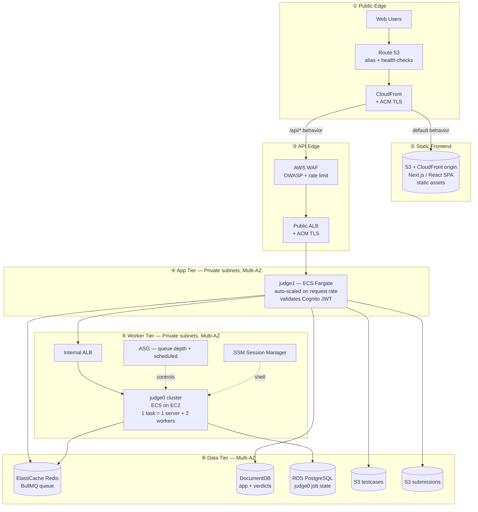

# Repovive Judge — AWS Migration Proposal

> Migrating the Repovive competitive programming judge from DigitalOcean + MongoDB to AWS, with a future-state post-round cheating-detection pipeline.

This repository is my graduation submission for the Manara **AWS Solutions Architect – Associate** course. It is structured as a real migration proposal, not a tutorial: every service is justified, every decision has an alternative considered and rejected, and the plan is phased so each step is independently rollback-able.

---

## Executive Summary

The Repovive judge stack — a custom orchestration layer (`judge1`) sitting on top of a horizontally-scaled `judge0` cluster — currently runs on DigitalOcean with all data, including test cases, in a single MongoDB instance. The setup works but has three structural problems: test cases in MongoDB cause cost and performance pressure that grows with the problem set; pre-round scaling is a manual ritual ("3 clicks") that does not survive surprise load; and there is no story for cross-AZ resilience, end-to-end tracing, or post-round analytics.

This proposal migrates the stack to AWS in five phases, keeps the existing `judge0` and `judge1` codebases largely intact, and adds a sixth phase that introduces a post-round cheating-detection pipeline (plagiarism, LLM-generated code, behavioral signals) built on Step Functions, AWS Batch, and Amazon Bedrock.

The keystone of the migration is moving test cases out of MongoDB into S3 — a change that can be made **before** any AWS infrastructure is provisioned, which de-risks the rest of the plan.

---

## Hero Architecture — Request Lifecycle



Three companion views (identity, monitoring, security/backup) and the full component breakdown live in [docs/03-architecture.md](./docs/03-architecture.md).

---

## Table of Contents

| # | Document | What's in it |
|---|----------|--------------|
| 1 | [Current State](./docs/01-current-state.md) | Today's DigitalOcean stack and its pain points |
| 2 | [Goals & Non-Goals](./docs/02-goals.md) | What we're solving for, and what we're explicitly not |
| 3 | [Target Architecture](./docs/03-architecture.md) | Four architectural views + component-by-component breakdown |
| 4 | [Cheating Detection Pipeline](./docs/04-cheating-detection.md) | Post-round Step Functions / Batch / Bedrock pipeline |
| 5 | [Design Decisions](./docs/05-design-decisions.md) | Eight architectural choices with options, rationale, alternatives |
| 6 | [Migration Plan](./docs/06-migration-plan.md) | Six phases, each with success criteria and rollback |
| 7 | [Well-Architected Mapping](./docs/07-well-architected.md) | Mapping to the six AWS WAFR pillars |
| 8 | [Risks & Mitigations](./docs/08-risks.md) | RTO/RPO targets + risk register |
| 9 | [Future Work](./docs/09-future-work.md) | Out-of-scope improvements queued for v2 |
| 10 | [Appendix](./docs/10-appendix.md) | Service inventory + scaling-signal sample |

---

## Repository Layout

```
.
├── README.md          ← this file — overview, hero diagram, TOC
├── docs/              ← detailed sections, each a standalone page
│   ├── 01-current-state.md
│   ├── 02-goals.md
│   ├── 03-architecture.md
│   ├── 04-cheating-detection.md
│   ├── 05-design-decisions.md
│   ├── 06-migration-plan.md
│   ├── 07-well-architected.md
│   ├── 08-risks.md
│   ├── 09-future-work.md
│   └── 10-appendix.md
└── scripts/           ← helper scripts (push, etc.)
```

Each doc file carries `← Prev | Next →` navigation at top and bottom, so you can read straight through or jump in.
