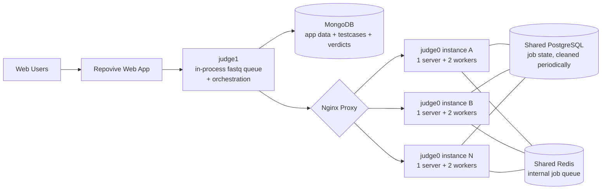

[← README](../README.md) | **Current State** | [Next: Judge Internals →](./01a-judge-internals.md)

---

# 1. Current State

## 1.1 Architecture

The flow for a single submission:

1. Web app POSTs a submission to `judge1`.
2. `judge1` enqueues the submission to an **in-process [`fastq`](https://github.com/mcollina/fastq) queue** — concurrency-limited (queue depth ≤ 500, configurable concurrency per scaling profile) so we don't OOM `judge0` containers. A semaphore + circuit breaker + backpressure stack in front of the Judge0 HTTP client adds a second layer of protection. See [Judge Internals §1a.3–1a.4](./01a-judge-internals.md) for the full picture.
3. A `judge1` worker pulls the submission, fetches test cases from MongoDB, and splits them into batches of 16.
4. Each batch is sent to a `judge0` server (round-robined by Nginx) as an async job with the compiled binary.
5. `judge1` polls `judge0` for completion of each batch.
6. Final verdict is written back to MongoDB and surfaced to the web app.

Operationally, `judge0` instances are deployed manually before contests using an in-house "3-click" scaling tool that provisions additional DigitalOcean droplets and updates Nginx.

## 1.2 Pain Points

**Test cases in MongoDB.** This is the single biggest issue. MongoDB has a 16 MB BSON document cap, large-document reads are slow, IOPS scale linearly with cost, and there is no CDN or lifecycle story. Test cases are large, immutable, read-heavy blobs — the textbook S3 use case.

**Manual scaling.** The 3-click scale-up is fast but it is still a human-in-the-loop and assumes we know the contest's load curve in advance. A surprise traffic spike (a problem going viral, a public class assignment, an unscheduled load test) is not handled.

**Ops burden of N nginx-fronted instances.** As `N` grows, the chance of configuration drift between droplets grows linearly. There is no central control plane.

**No observability.** We have basic process metrics, but no distributed tracing across `judge1` → fastq worker → `judge0` → Postgres, so root-causing a slow submission is guesswork.

**No disaster-recovery posture.** A datacenter incident at the current provider takes the whole platform offline. There is no Multi-AZ story for MongoDB, Postgres, or Redis.

**Postgres cleanup is a chore.** Periodic cleanup of the `judge0` job state runs on a host-cron and breaks silently.

---

[← README](../README.md) | **Current State** | [Next: Judge Internals →](./01a-judge-internals.md)
