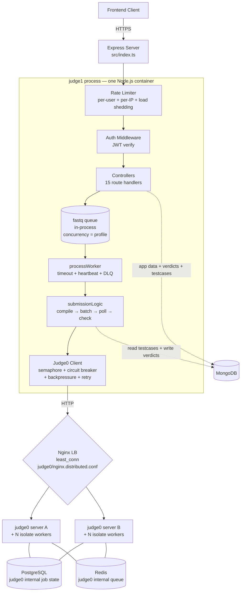
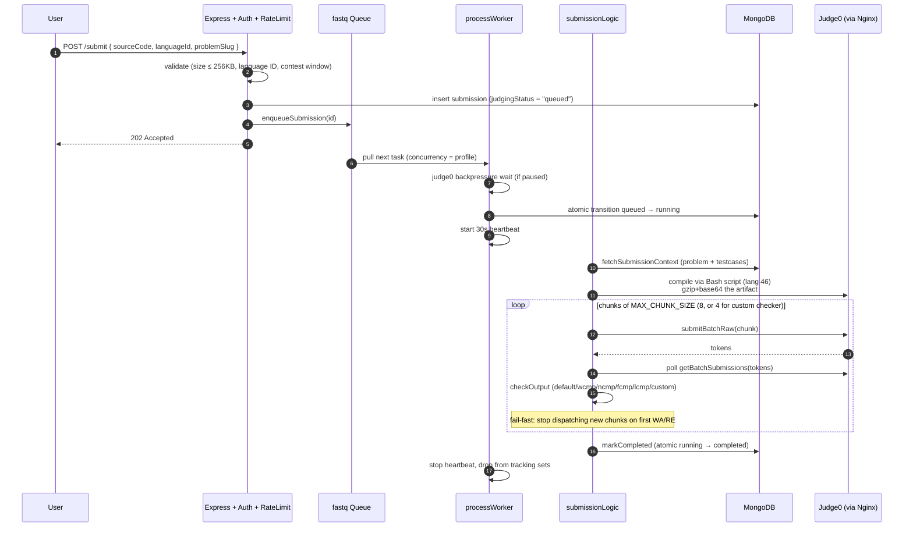
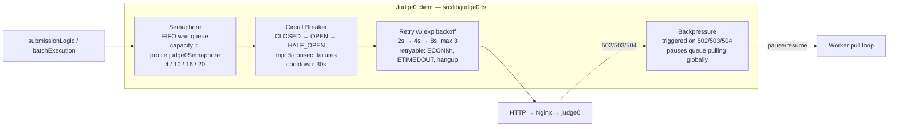
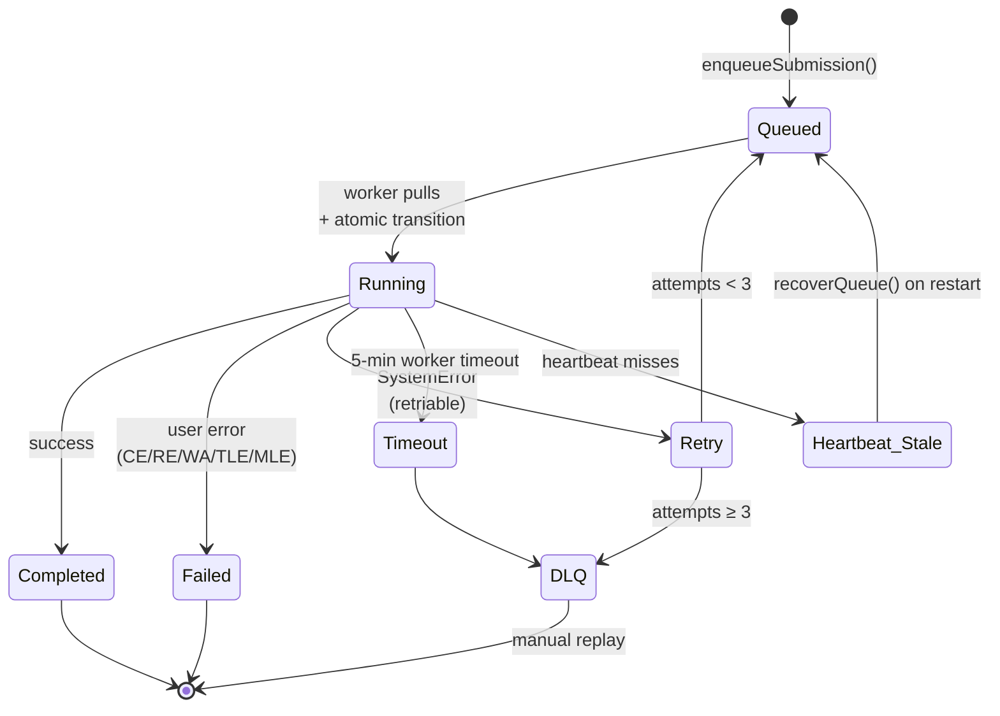
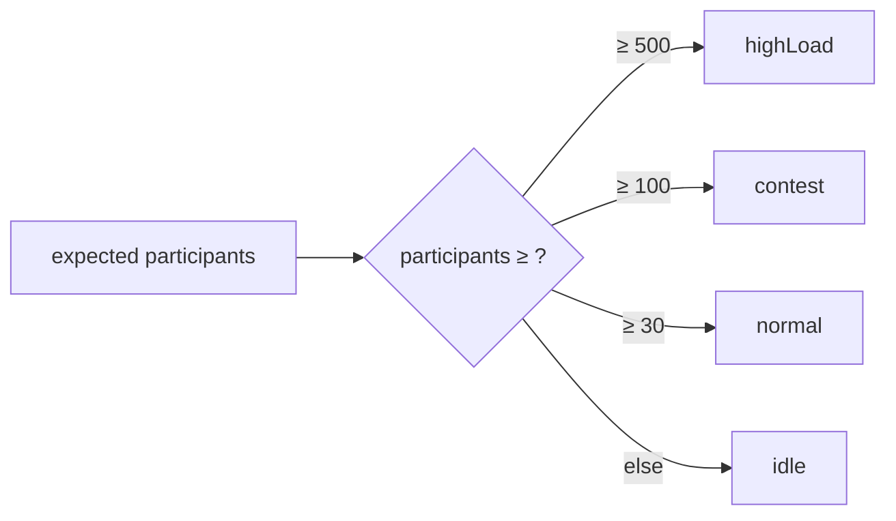

[← README](../README.md) | [← Prev: Current State](./01-current-state.md) | **Judge Internals (Current)** | [Next: Goals & Non-Goals →](./02-goals.md)

---

# 1a. Repovive Judge Internals — Current State (Deep Dive)

This document is the ground-truth companion to [Section 1 — Current State](./01-current-state.md). Where Section 1 sketches today's stack at the platform level (DigitalOcean droplets, MongoDB, Nginx, the manual 3-click scale-up), this document zooms inside `judge1` and `judge0` so the rest of the proposal can refer back to concrete subsystems instead of waving at "the orchestrator".

Every claim here is sourced from the live `judge1/ARCHITECTURE.md`. The point is not encyclopedic coverage — it is to make the migration story falsifiable: when [Target Architecture](./03-architecture.md) says "ElastiCache for Redis replaces the in-process queue", you should be able to come back here and see exactly what is being replaced.

---

## 1a.1 Process Topology

`judge1` is a single Node.js / Express process. Submissions cross five internal layers before they reach `judge0`:

Two things in this picture are easy to misread and matter for the migration:

- **The queue is in-process.** `judge1` uses [`fastq`](https://github.com/mcollina/fastq), an in-memory promise-based queue, not BullMQ. There is no Redis between `judge1` and its workers. If `judge1` crashes, in-flight tasks are recovered on restart by scanning MongoDB for stuck `queued`/`running` rows (`src/queue/recovery.ts`).
- **The only Redis in the system is internal to `judge0`.** It is part of `judge0`'s own deployment and is invisible to `judge1`. The migration introduces **ElastiCache for Redis** as a *new* component that backs a *new* BullMQ queue between `judge1` tasks — replacing the in-process fastq queue. That swap is the smallest moving part of the migration, but it is a moving part, not a "drop-in".

---

## 1a.2 Submission Pipeline

The end-to-end happy path, condensed into a sequence:

A few non-obvious details that the migration plan needs to preserve:

- **Compilation runs inside Judge0**, not in `judge1`. The bash script (`language_id=46`) decodes the source, compiles, then gzips and base64-encodes the artifact to stdout. Subsequent test cases restore the artifact in the sandbox. This means **`judge1` never needs build toolchains** — a real benefit when packaging it as a Fargate image.
- **Polling, not callbacks.** `judge1` polls Judge0 every 500ms per batch up to a 3-minute ceiling. This is intentional and documented as out of scope to change during the migration (see [Design Decisions §5](./05-design-decisions.md)).
- **Atomic status transitions.** Every state change goes through `statusTransitions.ts` with `updateOne` + filter on the expected prior state. This is what makes recovery-on-restart safe — see §1a.4.

---

## 1a.3 Judge0 Client — Three Layers of Protection

Every HTTP call from `judge1` to a `judge0` server passes through three independent guards. They exist because `judge0` running on shared droplets is the noisy neighbour of this stack — a slow or wedged worker upstream cascades into queue meltdown if nothing fences it off.

What each layer protects:

| Layer | Protects against | Where it lives |
|---|---|---|
| **Semaphore** | Stampeding `judge0` with concurrent API calls. Acquired and released **per HTTP call**, not for the duration of test execution — see `judge1/ARCHITECTURE.md §18e`. | `src/lib/judge0.ts` |
| **Circuit breaker** | Hammering a `judge0` that is already failing. Only infra errors (5xx, network errors) trip it; 4xx does not. | `src/lib/judge0.ts` |
| **Backpressure** | Pulling new tasks off the queue while `judge0` is overloaded. Triggered by 502/503/504 and pauses the entire `judge1` worker pool until recovery. | `src/lib/judge0Backpressure.ts` |
| **Retry** | Transient connection blips. Capped at 3 attempts with exponential backoff. | `src/lib/judge0.ts` |

This stack survives a partial `judge0` outage today. It is also the reason `judge1` cannot be naively swapped to call a different backend — the breaker and backpressure both assume the Judge0 HTTP error vocabulary.

---

## 1a.4 Queue, Worker & Failure Modes

The queue layer is more than the fastq instance — it also carries duplicate prevention, a DLQ, recovery-on-restart, and a heartbeat. The state machine looks like this:

Key configuration knobs (all in `src/queue/types.ts` and `src/scaling/profiles.ts`):

| Setting | Value | Source |
|---|---|---|
| `maxQueueSize` | 500 | hardcoded — 503 returned to clients past this |
| `maxRetries` | 3 | hardcoded |
| `concurrency` | profile-dependent (4 / 10 / 16 / 20) | scaling profile |
| `duplicateWindowMs` | 60 s | hardcoded |
| `stuckThresholdMs` | 10 min | hardcoded |
| Worker timeout | 5 min | `src/queue/worker.ts` |
| Heartbeat interval | 30 s | `src/queue/worker.ts` |
| DLQ capacity | 1000 entries (in-memory) | `src/queue/dlq.ts` |

Two consequences that matter for the AWS plan:

- **DLQ is in-memory.** If `judge1` is killed, the DLQ is lost. Anything stuck in `running` is replayed on restart via `recoverQueue()`, but a poisoned message that already burned its 3 retries silently disappears. The migration's switch to BullMQ on ElastiCache gives us a durable DLQ for free — flagged in [Risks](./08-risks.md).
- **The 500-deep cap is per-process.** Because the queue is in-process and `judge1` runs as a single instance today, this is also the global cap. The Fargate target architecture multiplies it by task count, which is a real capacity gain even before you touch autoscaling.

---

## 1a.5 Scaling Profiles

`judge1` ships with four profiles. They are selected at startup from `process.env.SCALING_PROFILE` (no live reload), and in practice are chosen by `selectProfileForParticipants()` ahead of a contest:

| Profile | queueConcurrency | judge0Semaphore | judge0Containers | Applied at runtime? |
|---|---|---|---|---|
| idle | 4 | 4 | 2 | concurrency + semaphore yes; container count via `docker compose --scale` |
| normal | 10 | 10 | 2 | same |
| contest | 16 | 16 | 2 | same |
| highLoad | 20 | 20 | 2 | same |

The honest version: `judge0Workers`, `workerCpus`, and the memory limits in the profile file are **decorative today** — they describe intent but are not applied at runtime (the actual values come from the Docker Compose file on disk). The 3-click manual scale-up is what materialises those numbers in production. This is the gap the AWS migration closes by binding the profile to ASG capacity, ECS task definition revisions, and a queue-depth-driven target-tracking policy — see [Target Architecture §3](./03-architecture.md) and [Appendix §10.2](./10-appendix.md).

---

## 1a.6 Data Layout Today

| Store | What's in it | Why it hurts |
|---|---|---|
| **MongoDB** (single instance) | App data, submissions, verdicts, problem definitions, **test cases**, runtime config overlay | Test cases are large immutable blobs that don't belong here — see [§1.2 pain points](./01-current-state.md#12-pain-points). IOPS scale linearly with cost; no Multi-AZ. |
| **PostgreSQL** (single instance, inside `judge0`) | `judge0` internal job state | Cleaned periodically by host-cron; failure is silent. |
| **Redis** (single instance, inside `judge0`) | `judge0` internal queue between its server and workers | Internal to `judge0`; `judge1` does not touch it. Not the same as the queue that will move to ElastiCache. |
| **In-memory (judge1 process)** | fastq queue, queuedSet + processingSet, DLQ, LRU caches for problems + checkers, scaling profile, rate-limit counters | All lost on restart. Recovery covers `queued`/`running` rows but not DLQ entries or rate-limit state. |

The single most leveraged change in the migration is moving test cases from MongoDB into S3. It is independently shippable, can be rolled back with a feature flag, and removes the largest cost driver from the legacy database — which is why it appears as **Phase 0** in the [Migration Plan](./06-migration-plan.md), executed before any AWS infrastructure is provisioned.

---

## 1a.7 Operational Reality

A few facts that are not visible from the code but shape the migration:

- **Single-host deployment.** `judge1`, `judge0` (server + workers + Postgres + Redis), and Nginx all run on one DigitalOcean droplet today (`45.55.191.46`). There is no inter-host networking story to migrate, but there is also no isolation — a `judge0` OOM can take `judge1` with it.
- **Deploys are `ssh + docker compose up --build -d`.** Documented in `judge1/README.md`. No CI/CD, no health-gated rollout. The AWS plan replaces this with ECR image builds + ECS service updates (rolling) and a CodePipeline thin shell — out of scope for the SAA project but enumerated in [Future Work](./09-future-work.md).
- **The 3-click scale-up is a human-in-the-loop ritual.** It works for known contests; it does not survive a problem going viral or an unscheduled class assignment. The target architecture removes the "click" by binding the same intent (more containers, higher concurrency) to ASG scheduled actions plus a target-tracking policy on a custom `Repovive/judge1/QueueDepth` metric — see [Appendix §10.2](./10-appendix.md).
- **No distributed tracing.** Structured JSON logs exist (`src/lib/logger.ts`) and there are sliding-window in-process metrics (`src/lib/metrics.ts`), but there is no way to correlate a slow submission across `judge1` → `judge0` → Postgres. X-Ray in the target architecture is the answer — explicitly enumerated as a [Goal](./02-goals.md).

---

[← README](../README.md) | [← Prev: Current State](./01-current-state.md) | **Judge Internals (Current)** | [Next: Goals & Non-Goals →](./02-goals.md)
