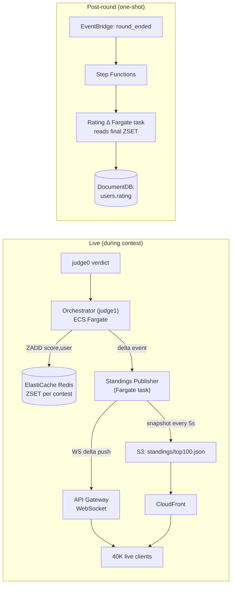

[← README](../README.md) | [← Prev: Requirements](./01-requirements.md) | **Architecture** | [Next: Post-Round Processing →](./03-post-round-processing.md)

---

# 2. Architecture

## 2.1 Overview

To keep each picture readable, the architecture is documented as **seven views**, each one a clean top-to-bottom pipeline:

- **2.1.1 Request lifecycle** — the spine: what happens when a user submits code.
- **2.1.2 Identity & user lifecycle** — sign-up, sign-in, transactional email.
- **2.1.3 Monitoring, logging & alerting** — what observes what, and how an alarm becomes a page.
- **2.1.4 Security, backup & supporting services** — KMS, Secrets Manager, GuardDuty/Config/Security Hub, AWS Backup, ECR, VPC Endpoints — each with its actual connection to the spine, not just listed.
- **2.1.5 VPC & network topology** — subnet tiers, AZ layout, NAT, VPC endpoints, and security-group lockdowns.
- **2.1.6 Autoscaling & capacity strategy** — the two-signal scaling story (scheduled warm-up + queue-depth target-tracking) and the mixed Spot / On-Demand fleet.
- **2.1.7 Live standings & rating** — how 40K concurrent users see real-time leaderboard updates without melting the database, and where rating deltas are computed.

### 2.1.1 Request Lifecycle

The hero diagram traces what happens to a single submission from the moment the user clicks **Submit** in the SPA to the moment a verdict lands back in their browser. It is the spine of the architecture — every other view in this section is a drill-down on a slice of this picture. Three properties are worth fixing in the reader's head before the rest of the document elaborates: the only public AWS endpoint is **CloudFront** (WAF runs there, ACM-issued TLS terminates there); the orchestrator (judge1) ALB only accepts traffic from the **CloudFront managed prefix list**, so it is not directly reachable from the open internet; and the verdict path is **asynchronous** — `judge0` runs the code on its own schedule and the result is pushed back over WebSocket, not held on the original HTTPS connection.

**Ingress.** Browser → CloudFront (`/api/*` behavior) → ALB → orchestrator (judge1) on Fargate. The orchestrator validates the Cognito JWT on every request against the User Pool's JWKS endpoint, with public keys cached in memory.

**Sandboxed execution.** Source is written to the `submissions` S3 bucket, then a job is enqueued to the BullMQ-on-Redis durable queue. A `judge0` worker on ECS-on-EC2 pulls the job, runs the code inside `isolate`, and persists the verdict to RDS Postgres (judge0 internal) and DocumentDB (app-level).

**Async return.** The original `POST /api/submissions` returns immediately with a submission ID. When the verdict is final, the orchestrator (judge1) pushes a message back to the user over **API Gateway WebSocket** to the connection that the SPA opened at sign-in — so the verdict surfaces in the UI without the client polling.

### 2.1.2 Identity & User Lifecycle

This view isolates everything **Amazon Cognito** does so the request-lifecycle picture above can stay focused on the submission path. Cognito's User Pool handles sign-up, sign-in, email verification, password reset, and MFA via its hosted UI, then issues a pair of JWTs (id + access) that the SPA stores and includes on every `/api/*` call. The orchestrator (judge1) never sees a password — it only ever validates a JWT signature against the User Pool's **JWKS** endpoint, with the public keys cached in memory.

**MFA posture.** TOTP MFA is enrolment-optional for end users and **required** for moderators and admins. The requirement is enforced at the User Pool level so a non-MFA token never reaches the orchestrator (judge1) in the first place.

**Mail path.** The User Pool is wired to **Amazon SES** as the email sender so verification mail comes from a verified domain rather than the default `no-reply@verificationemail.com`. SPF and DKIM are configured on the sending domain to protect deliverability; a bounce/complaint SNS topic feeds back into DocumentDB so hard-bounced addresses are auto-suppressed.

**Role-based access.** User attributes include `handle`, `email`, `role` (`user` / `moderator` / `admin`), and `rating`. The orchestrator (judge1) enforces the `role` claim on moderator and admin routes; end users never see those paths because the SPA reads the same claim and renders accordingly.

### 2.1.3 Monitoring, Logging & Alerting

This view collapses the entire observability stack into one picture: what produces signals, where those signals land, and how a metric becomes a page. Every container reports to CloudWatch (Container Insights on both ECS clusters), every request gets an X-Ray segment, every log line lands in a CloudWatch Log Group, and a small disciplined set of alarms route through SNS — `ops-critical` to PagerDuty, `ops-warning` to Slack. The intent is that an on-call engineer never has to *go looking* for a problem; the synthetic canary tells them the platform is broken before any user notices.

**Source-of-truth liveness signal.** A **CloudWatch Synthetics canary** runs every 5 minutes from a separate AWS account, signs into a dedicated synthetic Cognito user, submits a known submission to a known problem, and asserts the verdict matches. Two consecutive failures page on-call. This — not any infrastructure metric — is what proves the platform is up from a real user's perspective.

**Logging fanout.** Live, queryable streams land in **CloudWatch Logs** (Logs Insights for ad-hoc searches; 30 days for app, 365 days for audit groups). Long-retention copies — CloudFront access logs, ALB access logs, VPC Flow Logs, CloudTrail — land in the **S3 logs bucket** with Object Lock in Governance mode and a Glacier-transition lifecycle after 90 days.

**Tracing.** **AWS X-Ray** covers CloudFront → ALB → orchestrator (judge1) → `judge0` / DocumentDB / S3. The service map is the first thing an on-call engineer looks at when an alarm fires — it shows which hop owns the latency or error spike without digging through individual log groups.

### 2.1.4 Security, Backup & Supporting Services

This view answers the question "where does each cross-cutting AWS service actually plug in?" — KMS, Secrets Manager, GuardDuty / Config / Security Hub, AWS Backup, ECR, VPC Endpoints. None of these services live on the request path, but each one is load-bearing for defence-in-depth and disaster recovery. Drawing them on a separate view keeps the spine readable without hand-waving over compliance and durability.

**Encryption everywhere.** **KMS** customer-managed keys for S3 (testcases + submissions + logs), RDS, DocumentDB, EBS, and the ElastiCache replication group. **Secrets Manager** holds every database credential with rotation enabled. **CloudTrail** runs as a multi-region trail with log-file integrity validation.

**Backup posture.** **AWS Backup** runs a centralized backup plan: daily RDS and DocumentDB snapshots with 35-day retention, point-in-time-recovery on RDS, and S3 versioning on the `testcases` and `submissions` buckets for per-object rollback. Targets and retention live in one backup plan rather than scattered across per-service backup configurations.

**Threat detection + compliance.** **GuardDuty** for threat findings, **AWS Config** for resource-state rules (encryption-at-rest, public-bucket detection, SG-open-to-world) with auto-remediation via SSM documents where safe, **Security Hub** aggregating into a CIS-benchmarked dashboard. The whole defensive posture is built from managed services so there is no in-house detection engineering to maintain.

**Image supply chain.** **Amazon ECR** with scan-on-push gates the container build pipeline before any image reaches the orchestrator (judge1) or `judge0`. Findings above a configurable severity block the deploy.

### 2.1.5 VPC & Network Topology

This view enumerates the network shape explicitly because the rest of the architecture relies on it being correct. A single VPC (`10.0.0.0/16`) carries three subnet tiers spread across two Availability Zones: **public** (orchestrator ALB only — internet-facing but with its security group locked to the CloudFront managed prefix list), **private app** (orchestrator / judge1 ECS tasks), and **private worker/data** (`judge0`, ElastiCache, RDS, DocumentDB). Drawing the subnets and security-group lockdowns on a dedicated view is what makes the *"the only public AWS endpoint is CloudFront"* claim verifiable rather than assertional.

**No public data plane.** Neither the queue, nor the databases, nor the sandbox hosts have public IPs. The CloudFront → ALB path is the only ingress; outbound is NAT-gated and limited to OS / package updates.

**VPC Endpoints.** An **S3 gateway endpoint** plus **interface endpoints** for Secrets Manager, KMS, ECR (API + DKR), CloudWatch Logs, and STS keep AWS-service traffic off the public internet entirely. This both reduces NAT egress cost and removes a class of data-exfiltration risk — a compromised worker cannot reach `s3.amazonaws.com` over the internet because the route table sends that prefix to the gateway endpoint.

**NAT.** One **NAT Gateway per AZ** handles the residual outbound traffic (OS patching, third-party API calls). Every first-party AWS API call has a VPC endpoint and bypasses NAT entirely.

**Security groups.** Least-privilege chains: ALB SG accepts only CloudFront prefix list; orchestrator (judge1) SG accepts only the ALB SG; queue / databases / internal judge0 ALB SGs accept only the orchestrator (judge1) SG; RDS Postgres SG additionally accepts the `judge0` SG.

### 2.1.6 Autoscaling & Capacity Strategy

A contest is the only time this platform has meaningful load, and a contest's load curve is **scheduled** — start time is known to the minute, problem-unlock produces a ~1–2K-submission/sec burst within the first minute, then the rate decays over the rest of the round. The autoscaling story therefore uses two complementary signals on two different compute targets, plus a mixed-fleet purchasing strategy to keep idle cost near zero.

**Scheduled pre-warm.** An **EventBridge** rule fires 15 minutes before any known contest and bumps the `judge0` ASG desired-capacity to a contest-sized baseline. This avoids cold-start lag at problem-unlock — by the time the first submission lands, the workers are already running.

**Queue-depth target tracking.** A sidecar Lambda publishes `Judge/Orchestrator/QueueDepth` to CloudWatch every minute (the "waiting" count from BullMQ). The `judge0` ASG has a target-tracking policy on this metric — e.g. 50 waiting jobs per running task. This is the right signal: CPU on a busy `judge0` host is always ~100% by design (it's running untrusted code in a tight loop), so a CPU-based policy would either never fire or fire constantly.

**Orchestrator (judge1) scaling.** The Fargate service target-tracks **`ALBRequestCountPerTarget`** — a simpler request-rate signal that matches its stateless shape. No queue-depth heuristic needed; the orchestrator is the *producer* of queue load, not a consumer.

**Mixed On-Demand + Spot fleet.** The `judge0` ASG runs **1–2 On-Demand baseline instances** for idle-period traffic, with all surge capacity coming from **Spot**. A killed Spot instance simply re-queues its in-flight batch via the orchestrator's (judge1) visibility-timeout-and-retry logic, so the interruption risk is tolerable in exchange for typical 50–70% cost savings during contests.

### 2.1.7 Live Standings & Rating

A division-4 contest places ~40,000 users on the standings page simultaneously, each expecting near-real-time updates. The naïve approach — every standings reader polls the database every few seconds, or a cron job recomputes the full leaderboard every minute — collapses under that load. The architecture instead splits the problem into a **write path** (incremental rank updates on every verdict) and a **read path** (CloudFront-cached snapshot + WebSocket deltas), then handles **rating** as a separate post-round step.

**Write path.** Every accepted verdict that lands in the orchestrator (judge1) triggers a single `ZADD` into a **Redis sorted set** keyed `contest:{id}:standings`, with the score composed as `(solved_count, -penalty, -last_AC_time)` so `ZREVRANGE` returns the leaderboard in display order in O(log N). The orchestrator also publishes a small "rank delta" event onto an internal Redis pub/sub channel — only the affected user, their old rank, and their new rank.

**Read path.** A small **Standings Publisher** Fargate service subscribes to the Redis pub/sub channel and does two things: (a) pushes per-user delta messages over **API Gateway WebSocket** to subscribed clients, and (b) every 5 seconds, dumps the top-100 (`ZREVRANGE 0 99 WITHSCORES`) to `s3://standings/contest-{id}/top100.json`, which CloudFront caches with a 5-second TTL. The result: 39,900 of the 40,000 live users get the public top-100 from a CloudFront edge cache (one origin fetch per 5 seconds, not 40K), while logged-in users also receive a targeted WebSocket delta when *their own* rank changes.

**Rating calculation.** Rating is **post-round only** — there is no meaningful Elo update mid-contest, so the work moves into the existing Step Functions pipeline described in [Post-Round Processing](./03-post-round-processing.md). When the `round_ended` event fires, a Fargate task reads the final ZSET, applies the Codeforces-style simplified Elo formula in O(N log N) for N=30K, and writes per-user rating deltas back to DocumentDB. This is the same pattern as the cheating-detection branch — two parallel branches of one Step Functions execution.

## 2.2 Single-Submission Flow

This is the **request lifecycle** picture (§2.1.1) zoomed in on a single submission, with every component the submission touches drawn explicitly — including the ones the hero view deliberately collapses (the `submissions` S3 write, the BullMQ queue, the RDS Postgres write for judge0 internal state, the WebSocket return). Reading the diagram left-to-right reproduces the lifecycle of one verdict from `POST /api/submissions` to the WebSocket frame that surfaces "Accepted" in the user's browser. The earlier views explained each service in isolation; this view shows them composed end-to-end.

## 2.3 Component-by-Component Breakdown

**Web frontend — static single-page app on Amazon S3, served via CloudFront.** The web app is a **static SPA** (HTML, JS, CSS bundles) built in CI and synced to an S3 bucket. There is no server-side rendering tier and no frontend compute — every dynamic interaction is an authenticated HTTPS call from the browser to the orchestrator (judge1).

- **Amazon S3** — versioned, KMS-encrypted bucket holding the SPA build output (the hashed JS/CSS chunks and the entry `index.html`). The bucket is private; CloudFront accesses it via an **Origin Access Control** identity, so the bucket itself is never reachable from the public internet.
- **Amazon CloudFront** — single distribution with two behaviors: the default behavior (`/*`) serves the SPA from the S3 origin with a long TTL on hashed assets and a short TTL on `index.html`; an `/api/*` behavior origins to the orchestrator's ALB so browser API calls flow CloudFront → ALB → ECS Fargate without ever leaving the AWS network from the user's perspective. **AWS WAF** is attached to the distribution itself, so OWASP rules and rate-limiting are applied at the edge for both behaviors. The only public AWS endpoint is CloudFront.

**Orchestrator (judge1) — ECS Fargate behind an ALB.** No privileged-container requirements, so Fargate is the right choice. Container images are built in CI, pushed to **Amazon ECR** (with image scanning on push enabled), and pulled by the Fargate service. Auto-scales on request rate (target tracking on `ALBRequestCountPerTarget`). Each task pulls from the durable queue at the throttled rate, retrieves test cases from S3, and drives `judge0` calls. The orchestrator's ALB sits behind CloudFront's `/api/*` behavior — the ALB security group accepts traffic only from the CloudFront managed prefix list, so the ALB is not directly callable from the open internet. The orchestrator **validates the Cognito JWT** on every request against the User Pool's JWKS endpoint, with public keys cached in memory. Logs and traces flow to CloudWatch and X-Ray respectively.

**`judge0` cluster — ECS on EC2.** This is the most important architectural decision in this design: `judge0` uses `isolate` for sandboxing untrusted user code, which requires cgroups and privileged container access. **AWS Fargate does not support privileged mode**, so `judge0` workers must run on EC2 (via the ECS EC2 launch type, or a plain ASG-managed fleet). Each ECS task is shaped as 1 `judge0` server + 2 workers, giving a clean unit of capacity. The fleet sits behind an _internal_ ALB. The ASG is driven by two scaling signals: a scheduled action that scales up 15 minutes before any known contest, and a target-tracking policy on a custom CloudWatch metric — queue depth — that handles surprise load. Spot capacity is a strong fit for workers (a killed instance simply re-queues its in-flight batch), and is recommended for cost optimization once the platform stabilizes.

**ElastiCache for Redis — Multi-AZ.** Backs three workloads on the same replication group: the **durable submission queue** (BullMQ wire-compatible), the **live standings ZSET** (one sorted set per contest, `contest:{id}:standings`), and an internal **pub/sub channel** that the Standings Publisher subscribes to for rank-delta events. Cluster mode disabled is fine for the assumed scale; automatic failover and Multi-AZ are enabled. Three properties matter for the rest of the design: the queue is durable (a crashed orchestrator (judge1) task does not lose in-flight work), queue depth is exposed as a first-class CloudWatch metric for autoscaling, and the standings ZSET gives O(log N) inserts and O(log N + k) range reads — orders of magnitude cheaper than any per-minute "recompute the whole leaderboard" job.

**Standings Publisher — ECS Fargate.** A small stateless service whose only job is fanning standings updates out to clients. It subscribes to the Redis pub/sub `standings:deltas` channel, pushes per-user rank deltas to subscribed WebSocket clients via the API Gateway WebSocket Management API, and every 5 seconds writes a fresh `top100.json` to S3 (which CloudFront serves with a 5-second TTL). Stateless, so it scales the same way as the orchestrator (judge1) — target-tracking on `ALBRequestCountPerTarget`, or a simpler `CPUUtilization` target since its work is bursty-but-uniform.

**API Gateway WebSocket — live verdict and standings push.** A single WebSocket API handles two distinct push channels: per-user **verdict notifications** (sent by the orchestrator (judge1) when a submission finalizes) and per-user **standings rank deltas** (sent by the Standings Publisher). Cognito JWT is validated on the `$connect` route via a Lambda authorizer; the client's Cognito `sub` is the connection key. API Gateway WebSocket scales to 1M concurrent connections with the default account limits, comfortably above the 40K target.

**Amazon DocumentDB — app data, replica set.** MongoDB-compatible storage for the application data layer (problems metadata, users, submissions, verdicts). The caveat — DocumentDB is not feature-complete with MongoDB — is handled explicitly in [Design Decisions](./04-design-decisions.md).

**Amazon S3 — test cases and submission code, two buckets.**
The `testcases` bucket is keyed by `{problem_id}/{testcase_id}.{in|out}`, versioned, KMS-encrypted, with a lifecycle rule to transition cold problems to S3 Intelligent-Tiering.
The `submissions` bucket is keyed by `{contest_id}/{user_id}/{submission_id}.{ext}` and stores the user-submitted source. DocumentDB stores metadata pointing to the S3 object. This separation is the precondition for the [post-round processing pipeline](./03-post-round-processing.md).

**RDS PostgreSQL — Multi-AZ.** Hosts `judge0`'s internal job state. Multi-AZ for automatic failover. State cleanup runs as an EventBridge schedule firing a Lambda — no host to maintain.

**Networking.** Single VPC, three subnet tiers across two AZs: public (orchestrator ALB only — internet-facing but SG-locked to the CloudFront managed prefix list), private app (orchestrator / judge1 ECS tasks), private workers (`judge0`, ElastiCache, RDS, DocumentDB). NAT Gateway for outbound OS/package updates only — all AWS-service traffic is kept off the public internet via **VPC endpoints**: an S3 gateway endpoint, plus interface endpoints for Secrets Manager, KMS, ECR (API + DKR), and CloudWatch Logs. This both reduces NAT egress cost and removes a class of data-exfiltration risk. Security groups follow least-privilege: only the orchestrator (judge1) can reach the queue and the internal `judge0` ALB; only `judge0` can reach RDS Postgres; both can reach DocumentDB and S3.

**DNS and TLS.** **Route 53** hosts the public zone, with an A-record alias pointing to the CloudFront distribution and a Route 53 health check tied to the CloudWatch Synthetics canary's success state; this health check is the trigger for any future failover routing policy. **AWS Certificate Manager (ACM)** issues and renews the TLS cert used at CloudFront and the orchestrator ALB — both are ACM-managed so there is nothing to rotate by hand.

**Operator access.** No bastion host. Operators reach `judge0` instances via **AWS Systems Manager Session Manager**, which gives shell access through IAM with full session logging to CloudWatch and no inbound SSH port open. This also covers patching via SSM Patch Manager and parameter storage for non-secret config.

**Security.** AWS WAF attached to the **CloudFront distribution** (the only externally-reachable endpoint) with rate-based rules and the AWS Managed Common Rule Set — protection therefore covers static assets and API traffic uniformly. Secrets Manager for all DB credentials with rotation enabled. KMS customer-managed keys for S3, RDS, DocumentDB, and EBS. CloudTrail enabled across the account with log-file integrity validation. GuardDuty enabled for threat detection (low-effort, high-signal). **AWS Config** records resource state and runs managed conformance rules (encryption-at-rest, public-bucket detection, SG-open-to-world); non-compliant findings auto-remediate via SSM documents where safe. **AWS Security Hub** aggregates GuardDuty, Config, and Inspector findings into a single CIS-benchmarked dashboard.

**Identity — Amazon Cognito User Pool.** The pool handles sign-up, sign-in, email verification, password reset, and optional MFA. The hosted UI delivers the login experience (no custom login screen to build and maintain). On successful login the pool issues an **id token** (user attributes) and an **access token** (used as the `Authorization: Bearer` header for `/api/*`). User attributes include `handle`, `email`, `role` (`user` / `moderator` / `admin`), and `rating`. The orchestrator (judge1) validates JWT signatures against the User Pool's JWKS endpoint and enforces role claims on moderator and admin endpoints. Moderators and admins are required to enrol in TOTP MFA. The Cognito pool is configured to use Amazon SES as the email sender (see below) so verification mail comes from a verified domain rather than the default `no-reply@verificationemail.com`.

**Transactional email — Amazon SES.** SES, configured in production sending mode with a verified domain identity, handles all outbound mail: Cognito verification and password-reset messages, contest invitations, verdict-finalized notifications (opt-in), and moderator alerts. DKIM and SPF are configured on the sending domain to maximise deliverability. A bounce/complaint SNS topic feeds back into DocumentDB so addresses with hard bounces are auto-suppressed.

**Monitoring and alerting.** Concrete posture, not a hand-wave:

- **CloudWatch Container Insights** enabled on both ECS clusters (orchestrator / judge1 on Fargate and `judge0` on EC2), giving per-task CPU / memory / network panels for free.
- **Custom metric `Judge/Orchestrator/QueueDepth`** published every minute by a sidecar Lambda that reads the "waiting" count from the ElastiCache-backed queue (also feeds the worker autoscaling policy — see [Appendix](./08-appendix.md)).
- **Alarms** (each routed to one of two SNS topics):
  - `CloudFront-5xx-rate > 1%` over 5 min → **ops-critical**
  - `Orchestrator-ALB-5xx-rate > 1%` over 5 min → **ops-critical**
  - `Orchestrator-ALB-p99-target-response-time > 3s` for 10 min → **ops-warning**
  - `Orchestrator-ALB-unhealthy-host-count > 0` for 2 min → **ops-critical**
  - `orchestrator-running-task-count < desired` for 5 min → **ops-critical**
  - `RDS-CPU > 80%` for 10 min → **ops-warning**
  - `RDS-FreeStorage < 20%` → **ops-critical**
  - `DocumentDB-CPU > 80%` for 10 min → **ops-warning**
  - `QueueDepth > 1000` for 5 min → **ops-warning**
  - `Synthetics-canary-failure` (two consecutive failures) → **ops-critical**
- **SNS topics**:
  - `ops-critical` → PagerDuty integration (pages on-call) + email.
  - `ops-warning` → Slack webhook + email.
- **CloudWatch Synthetics canary** runs every 5 minutes from a separate AWS account: it logs into a dedicated synthetic Cognito user, submits a known submission to a known problem, polls for the verdict, and asserts the verdict matches expected. This is the single best signal that the platform is up *from a user's perspective* — better than any infrastructure metric.
- **AWS X-Ray** tracing covers CloudFront → ALB → orchestrator (judge1) → judge0 / DocumentDB / S3. The X-Ray service map is the first place an on-call engineer looks when an alarm fires.

**Centralized logging.** Every log type lands in one of two destinations: **CloudWatch Logs** for live, queryable streams (with Logs Insights for ad-hoc searches), or the **S3 logs bucket** for long-retention, low-cost storage.

- Per-service CloudWatch Log Groups (`/judge/orchestrator`, `/judge/judge0`) with **30-day retention** for application logs.
- Audit-class log groups (`/judge/audit/*`) with **365-day retention**.
- **CloudFront access logs** → S3 logs bucket (`cloudfront/`).
- **ALB access logs** (orchestrator and `judge0`) → S3 logs bucket (`alb/`).
- **VPC Flow Logs** for the private subnets → S3 logs bucket (`vpc-flow/`) — REJECT + ACCEPT.
- **CloudTrail** multi-region trail → S3 logs bucket (`cloudtrail/`), with log-file integrity validation enabled.
- The **S3 logs bucket** is KMS-encrypted with a dedicated CMK, has **Object Lock in Governance mode** (compliance audit requirement), and lifecycle rules that transition objects to S3 Glacier Flexible Retrieval after 90 days and expire them at 7 years.

---

[← README](../README.md) | [← Prev: Requirements](./01-requirements.md) | **Architecture** | [Next: Post-Round Processing →](./03-post-round-processing.md)
