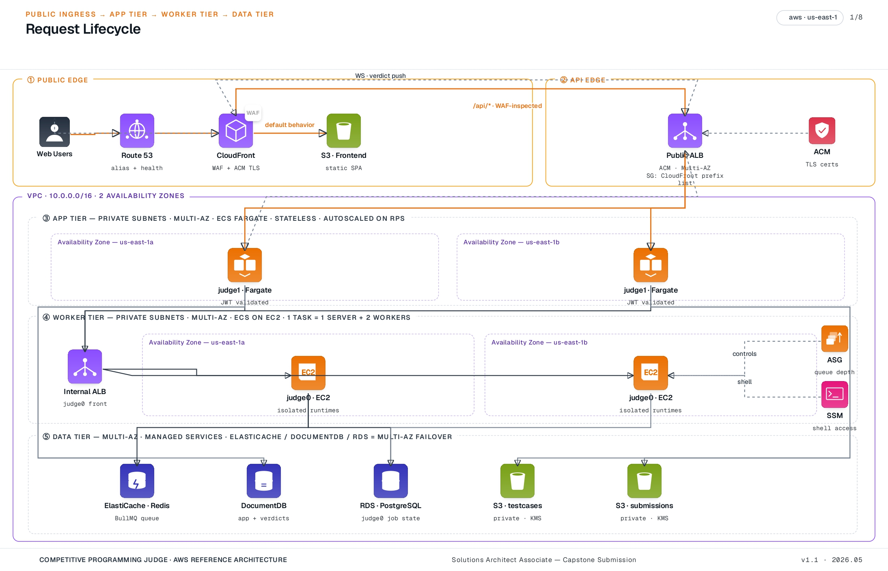
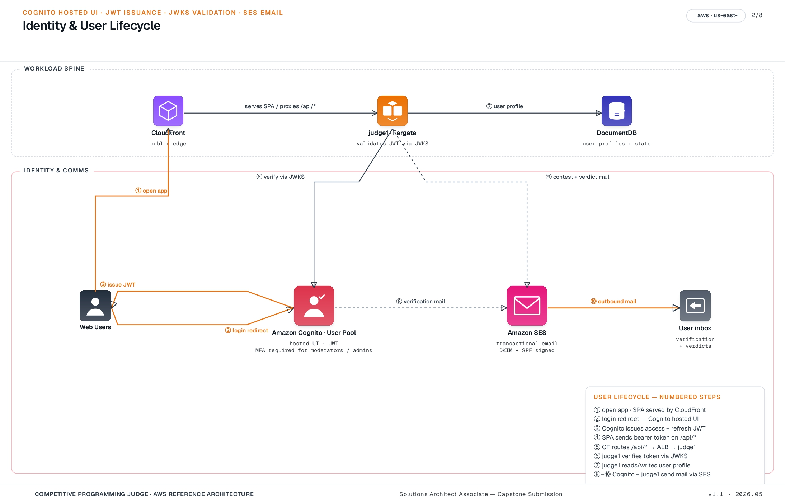
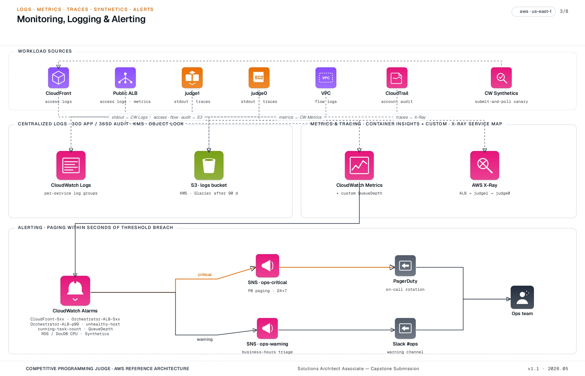
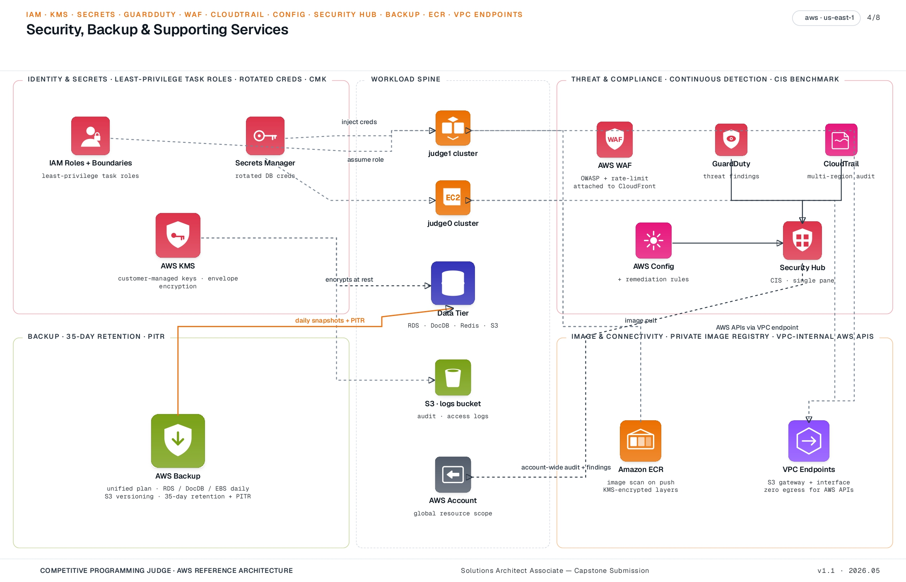
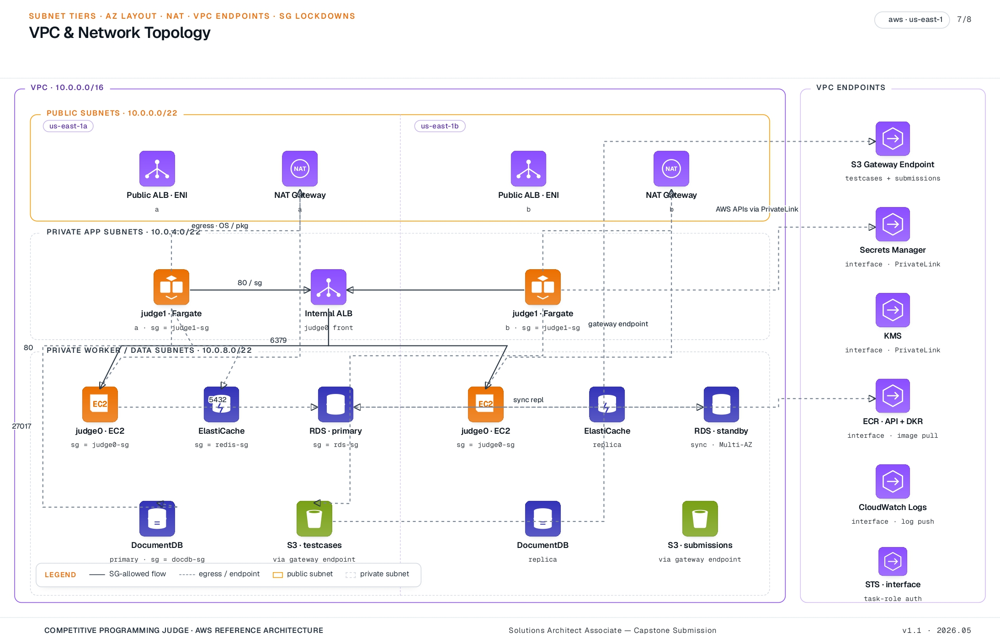
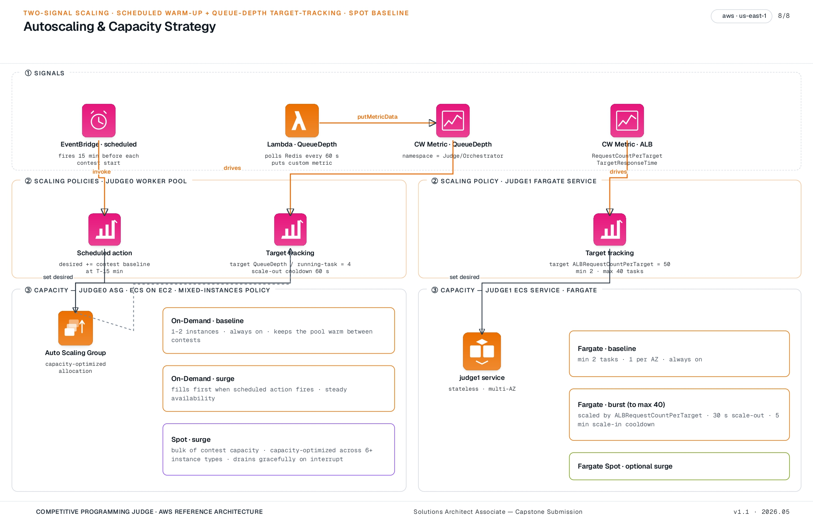
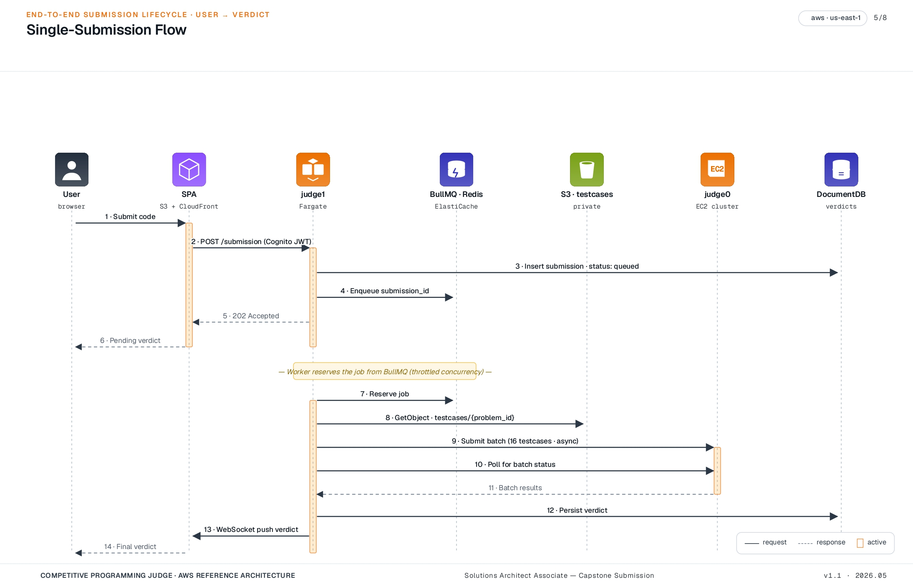

[← README](../README.md) | [← Prev: Requirements](./01-requirements.md) | **Architecture** | [Next: Cheating Detection →](./03-cheating-detection.md)

---

# 2. Architecture

## 2.1 Overview

To keep each picture readable, the architecture is documented as **six views**, each one a clean top-to-bottom pipeline:

- **2.1.1 Request lifecycle** — the spine: what happens when a user submits code.
- **2.1.2 Identity & user lifecycle** — sign-up, sign-in, transactional email.
- **2.1.3 Monitoring, logging & alerting** — what observes what, and how an alarm becomes a page.
- **2.1.4 Security, backup & supporting services** — KMS, Secrets Manager, GuardDuty/Config/Security Hub, AWS Backup, ECR, VPC Endpoints — each with its actual connection to the spine, not just listed.
- **2.1.5 VPC & network topology** — subnet tiers, AZ layout, NAT, VPC endpoints, and security-group lockdowns.
- **2.1.6 Autoscaling & capacity strategy** — the two-signal scaling story (scheduled warm-up + queue-depth target-tracking) and the mixed Spot / On-Demand fleet.

### 2.1.1 Request Lifecycle

### 2.1.2 Identity & User Lifecycle

### 2.1.3 Monitoring, Logging & Alerting

### 2.1.4 Security, Backup & Supporting Services

### 2.1.5 VPC & Network Topology

### 2.1.6 Autoscaling & Capacity Strategy

## 2.2 Single-Submission Flow

## 2.3 Component-by-Component Breakdown

**Web frontend — static single-page app on Amazon S3, served via CloudFront.** The web app is a **static SPA** (HTML, JS, CSS bundles) built in CI and synced to an S3 bucket. There is no server-side rendering tier and no frontend compute — every dynamic interaction is an authenticated HTTPS call from the browser to the orchestrator (judge1).

- **Amazon S3** — versioned, KMS-encrypted bucket holding the SPA build output (the hashed JS/CSS chunks and the entry `index.html`). The bucket is private; CloudFront accesses it via an **Origin Access Control** identity, so the bucket itself is never reachable from the public internet.
- **Amazon CloudFront** — single distribution with two behaviors: the default behavior (`/*`) serves the SPA from the S3 origin with a long TTL on hashed assets and a short TTL on `index.html`; an `/api/*` behavior origins to the orchestrator's ALB so browser API calls flow CloudFront → ALB → ECS Fargate without ever leaving the AWS network from the user's perspective. **AWS WAF** is attached to the distribution itself, so OWASP rules and rate-limiting are applied at the edge for both behaviors. The only public AWS endpoint is CloudFront.

**Orchestrator (judge1) — ECS Fargate behind an ALB.** No privileged-container requirements, so Fargate is the right choice. Container images are built in CI, pushed to **Amazon ECR** (with image scanning on push enabled), and pulled by the Fargate service. Auto-scales on request rate (target tracking on `ALBRequestCountPerTarget`). Each task pulls from the durable queue at the throttled rate, retrieves test cases from S3, and drives `judge0` calls. The orchestrator's ALB sits behind CloudFront's `/api/*` behavior — the ALB security group accepts traffic only from the CloudFront managed prefix list, so the ALB is not directly callable from the open internet. The orchestrator **validates the Cognito JWT** on every request against the User Pool's JWKS endpoint, with public keys cached in memory. Logs and traces flow to CloudWatch and X-Ray respectively.

**`judge0` cluster — ECS on EC2.** This is the most important architectural decision in this design: `judge0` uses `isolate` for sandboxing untrusted user code, which requires cgroups and privileged container access. **AWS Fargate does not support privileged mode**, so `judge0` workers must run on EC2 (via the ECS EC2 launch type, or a plain ASG-managed fleet). Each ECS task is shaped as 1 `judge0` server + 2 workers, giving a clean unit of capacity. The fleet sits behind an _internal_ ALB. The ASG is driven by two scaling signals: a scheduled action that scales up 15 minutes before any known contest, and a target-tracking policy on a custom CloudWatch metric — queue depth — that handles surprise load. Spot capacity is a strong fit for workers (a killed instance simply re-queues its in-flight batch), and is recommended for cost optimization once the platform stabilizes.

**ElastiCache for Redis — Multi-AZ.** Backs the durable submission queue (BullMQ wire-compatible). Cluster mode disabled is fine for the assumed scale; automatic failover and Multi-AZ are enabled. Two properties matter for the rest of the design: the queue is durable (a crashed orchestrator (judge1) task does not lose in-flight work), and queue depth is exposed as a first-class CloudWatch metric for autoscaling.

**Amazon DocumentDB — app data, replica set.** MongoDB-compatible storage for the application data layer (problems metadata, users, submissions, verdicts). The caveat — DocumentDB is not feature-complete with MongoDB — is handled explicitly in [Design Decisions](./04-design-decisions.md).

**Amazon S3 — test cases and submission code, two buckets.**
The `testcases` bucket is keyed by `{problem_id}/{testcase_id}.{in|out}`, versioned, KMS-encrypted, with a lifecycle rule to transition cold problems to S3 Intelligent-Tiering.
The `submissions` bucket is keyed by `{contest_id}/{user_id}/{submission_id}.{ext}` and stores the user-submitted source. DocumentDB stores metadata pointing to the S3 object. This separation is the precondition for the [cheating-detection pipeline](./03-cheating-detection.md).

**RDS PostgreSQL — Multi-AZ.** Hosts `judge0`'s internal job state. Multi-AZ for automatic failover. State cleanup runs as an EventBridge schedule firing a Lambda — no host to maintain.

**Networking.** Single VPC, three subnet tiers across two AZs: public (orchestrator ALB only — internet-facing but SG-locked to the CloudFront managed prefix list), private app (orchestrator / judge1 ECS tasks), private workers (`judge0`, ElastiCache, RDS, DocumentDB). NAT Gateway for outbound OS/package updates only — all AWS-service traffic is kept off the public internet via **VPC endpoints**: an S3 gateway endpoint, plus interface endpoints for Secrets Manager, KMS, ECR (API + DKR), and CloudWatch Logs. This both reduces NAT egress cost and removes a class of data-exfiltration risk. Security groups follow least-privilege: only the orchestrator (judge1) can reach the queue and the internal `judge0` ALB; only `judge0` can reach RDS Postgres; both can reach DocumentDB and S3.

**DNS and TLS.** **Route 53** hosts the public zone, with an A-record alias pointing to the CloudFront distribution and a Route 53 health check tied to the CloudWatch Synthetics canary's success state; this health check is the trigger for any future failover routing policy. **AWS Certificate Manager (ACM)** issues and renews the TLS cert used at CloudFront and the orchestrator ALB — both are ACM-managed so there is nothing to rotate by hand.

**Operator access.** No bastion host. Operators reach `judge0` instances via **AWS Systems Manager Session Manager**, which gives shell access through IAM with full session logging to CloudWatch and no inbound SSH port open. This also covers patching via SSM Patch Manager and parameter storage for non-secret config.

**Security.** AWS WAF attached to the **CloudFront distribution** (the only externally-reachable endpoint) with rate-based rules and the AWS Managed Common Rule Set — protection therefore covers static assets and API traffic uniformly. Secrets Manager for all DB credentials with rotation enabled. KMS customer-managed keys for S3, RDS, DocumentDB, and EBS. CloudTrail enabled across the account with log-file integrity validation. GuardDuty enabled for threat detection (low-effort, high-signal). **AWS Config** records resource state and runs managed conformance rules (encryption-at-rest, public-bucket detection, SG-open-to-world); non-compliant findings auto-remediate via SSM documents where safe. **AWS Security Hub** aggregates GuardDuty, Config, and Inspector findings into a single CIS-benchmarked dashboard.

**Identity — Amazon Cognito User Pool.** The pool handles sign-up, sign-in, email verification, password reset, and optional MFA. The hosted UI delivers the login experience (no custom login screen to build and maintain). On successful login the pool issues an **id token** (user attributes) and an **access token** (used as the `Authorization: Bearer` header for `/api/*`). User attributes include `handle`, `email`, `role` (`user` / `moderator` / `admin`), and `rating`. The orchestrator (judge1) validates JWT signatures against the User Pool's JWKS endpoint and enforces role claims on moderator and admin endpoints. Moderators and admins are required to enrol in TOTP MFA. The Cognito pool is configured to use Amazon SES as the email sender (see below) so verification mail comes from a verified domain rather than the default `no-reply@verificationemail.com`.

**Transactional email — Amazon SES.** SES, configured in production sending mode with a verified domain identity, handles all outbound mail: Cognito verification and password-reset messages, contest invitations, verdict-finalized notifications (opt-in), and moderator alerts. DKIM and SPF are configured on the sending domain to maximise deliverability. A bounce/complaint SNS topic feeds back into DocumentDB so addresses with hard bounces are auto-suppressed.

**Monitoring and alerting.** Concrete posture, not a hand-wave:

- **CloudWatch Container Insights** enabled on both ECS clusters (orchestrator / judge1 on Fargate and `judge0` on EC2), giving per-task CPU / memory / network panels for free.
- **Custom metric `Judge/Orchestrator/QueueDepth`** published every minute by a sidecar Lambda that reads the "waiting" count from the ElastiCache-backed queue (also feeds the worker autoscaling policy — see [Appendix](./08-appendix.md)).
- **Alarms** (each routed to one of two SNS topics):
  - `CloudFront-5xx-rate > 1%` over 5 min → **ops-critical**
  - `Orchestrator-ALB-5xx-rate > 1%` over 5 min → **ops-critical**
  - `Orchestrator-ALB-p99-target-response-time > 3s` for 10 min → **ops-warning**
  - `Orchestrator-ALB-unhealthy-host-count > 0` for 2 min → **ops-critical**
  - `orchestrator-running-task-count < desired` for 5 min → **ops-critical**
  - `RDS-CPU > 80%` for 10 min → **ops-warning**
  - `RDS-FreeStorage < 20%` → **ops-critical**
  - `DocumentDB-CPU > 80%` for 10 min → **ops-warning**
  - `QueueDepth > 1000` for 5 min → **ops-warning**
  - `Synthetics-canary-failure` (two consecutive failures) → **ops-critical**
- **SNS topics**:
  - `ops-critical` → PagerDuty integration (pages on-call) + email.
  - `ops-warning` → Slack webhook + email.
- **CloudWatch Synthetics canary** runs every 5 minutes from a separate AWS account: it logs into a dedicated synthetic Cognito user, submits a known submission to a known problem, polls for the verdict, and asserts the verdict matches expected. This is the single best signal that the platform is up *from a user's perspective* — better than any infrastructure metric.
- **AWS X-Ray** tracing covers CloudFront → ALB → orchestrator (judge1) → judge0 / DocumentDB / S3. The X-Ray service map is the first place an on-call engineer looks when an alarm fires.

**Centralized logging.** Every log type lands in one of two destinations: **CloudWatch Logs** for live, queryable streams (with Logs Insights for ad-hoc searches), or the **S3 logs bucket** for long-retention, low-cost storage.

- Per-service CloudWatch Log Groups (`/judge/orchestrator`, `/judge/judge0`) with **30-day retention** for application logs.
- Audit-class log groups (`/judge/audit/*`) with **365-day retention**.
- **CloudFront access logs** → S3 logs bucket (`cloudfront/`).
- **ALB access logs** (orchestrator and `judge0`) → S3 logs bucket (`alb/`).
- **VPC Flow Logs** for the private subnets → S3 logs bucket (`vpc-flow/`) — REJECT + ACCEPT.
- **CloudTrail** multi-region trail → S3 logs bucket (`cloudtrail/`), with log-file integrity validation enabled.
- The **S3 logs bucket** is KMS-encrypted with a dedicated CMK, has **Object Lock in Governance mode** (compliance audit requirement), and lifecycle rules that transition objects to S3 Glacier Flexible Retrieval after 90 days and expire them at 7 years.

---

[← README](../README.md) | [← Prev: Requirements](./01-requirements.md) | **Architecture** | [Next: Cheating Detection →](./03-cheating-detection.md)
