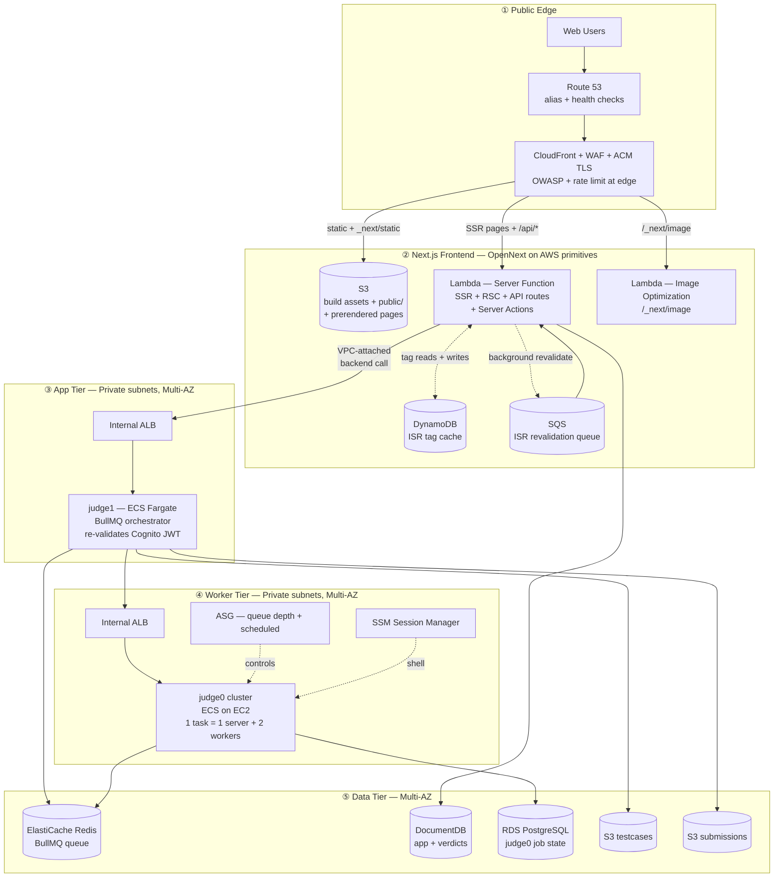
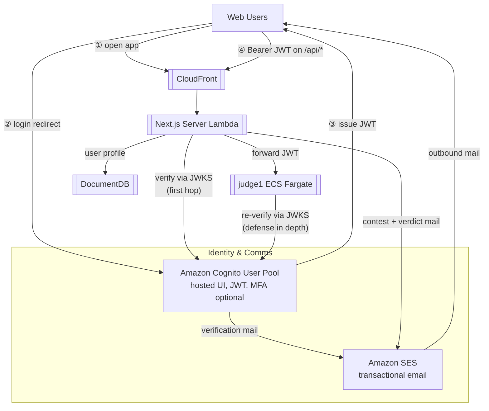
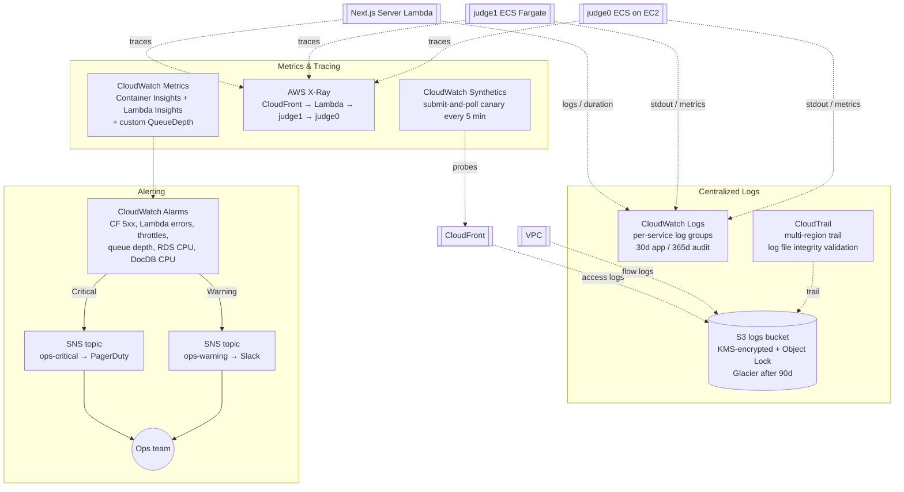
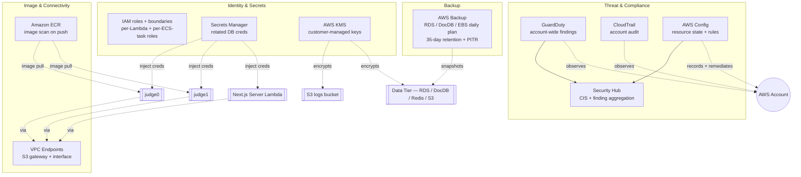
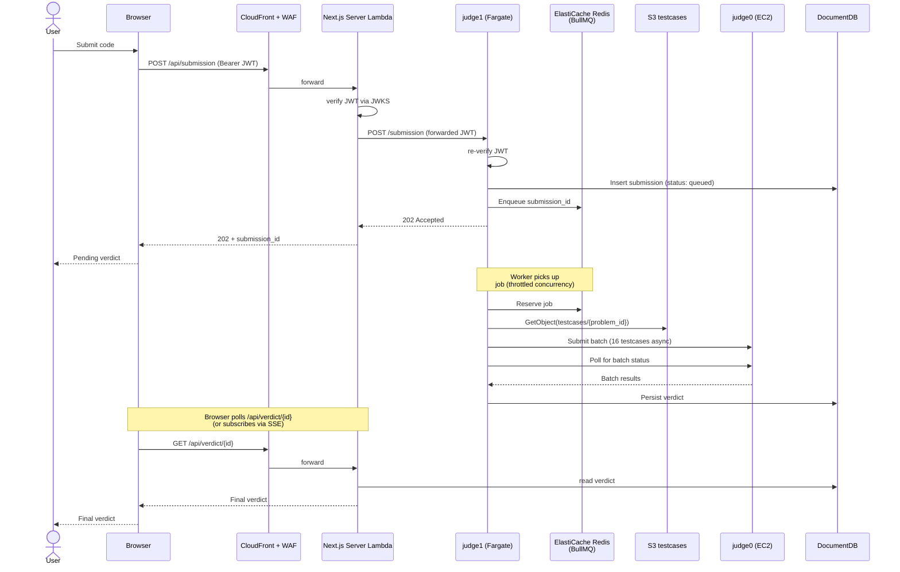

[← README](../README.md) | [← Prev: Goals](./02-goals.md) | **Target Architecture** | [Next: Cheating Detection →](./04-cheating-detection.md)

---

# 3. Target Architecture

## 3.1 Overview

To keep each picture readable, the architecture is documented as **four views**, each one a clean top-to-bottom pipeline:

- **3.1.1 Request lifecycle** — the spine: what happens when a user submits code.
- **3.1.2 Identity & user lifecycle** — sign-up, sign-in, transactional email.
- **3.1.3 Monitoring, logging & alerting** — what observes what, and how an alarm becomes a page.
- **3.1.4 Security, backup & supporting services** — KMS, Secrets Manager, GuardDuty/Config/Security Hub, AWS Backup, ECR, VPC Endpoints — each with its actual connection to the spine, not just listed.

### 3.1.1 Request Lifecycle

### 3.1.2 Identity & User Lifecycle

### 3.1.3 Monitoring, Logging & Alerting

### 3.1.4 Security, Backup & Supporting Services

## 3.2 Single-Submission Flow

## 3.3 Component-by-Component Breakdown

**Web frontend — Next.js on AWS-native serverless primitives (OpenNext pattern).** The [Repovive](https://repovive.com/) web app is a **full Next.js application** with heavy use of server-side rendering, React Server Components, API routes, and Server Actions — it is not a static SPA, and a static export would discard most of its functionality. The deployment target is **AWS primitives composed in the OpenNext shape** rather than a single managed service:

- **Amazon S3** — versioned bucket holding the Next.js build output: hashed `_next/static/*` chunks, the `public/` tree, and prerendered HTML for routes that use SSG / ISR.
- **AWS Lambda — Server Function** — the Next.js Node runtime wrapped as a Lambda behind a Function URL. Handles SSR pages, RSC payloads, API routes (`/api/*`), and Server Actions. VPC-attached so it can reach the internal `judge1` ALB, DocumentDB, and ElastiCache directly without going through the public internet.
- **AWS Lambda — Image Optimization** — a dedicated Lambda for `/_next/image` so on-the-fly resizing doesn't share the Server Function's cold-start budget.
- **Amazon DynamoDB — ISR tag cache** — stores Next.js cache tags and per-route revalidation metadata. On-demand capacity; TTL on entries.
- **Amazon SQS — ISR revalidation queue** — when a Server Action calls `revalidateTag()`, a message lands here; a queue consumer Lambda regenerates the affected pages in the background instead of blocking the user request.
- **Amazon CloudFront** — single distribution with three behaviors: `/_next/static/*` and `/public/*` → S3 origin (long TTL); `/_next/image*` → Image Lambda Function URL; everything else (pages + `/api/*`) → Server Lambda Function URL. **AWS WAF** is attached to the distribution itself, so OWASP rules and rate-limiting are applied at the edge for every behavior including server-rendered pages and API routes. There is no longer a public ALB — the only public AWS endpoint is CloudFront.
- **Cold-start mitigation** — **provisioned concurrency** on the Server Function is enabled on a scheduled action 15 minutes before known contests (mirroring the `judge0` scheduled scale-up). Outside contest windows, on-demand concurrency is fine for the steady traffic level.
- **Connection pooling** — DocumentDB connections are reused across warm Lambda invocations by initialising the client outside the handler. If RDS access from Lambda is added later (currently RDS is only touched by `judge0`), **RDS Proxy** is the pattern.

The split between Next.js API routes and `judge1` is deliberate: lightweight, request-scoped logic (auth callbacks, form validation, user profile reads, light DocumentDB queries) runs in the Server Lambda; the heavy stuff (BullMQ enqueue, `judge0` orchestration, polling, verdict aggregation) stays in `judge1` Fargate where a long-lived process with a connection pool is the right shape.

**`judge1` — ECS Fargate behind an internal ALB.** No privileged-container requirements, so Fargate is the right choice. Container images are built in CI, pushed to **Amazon ECR** (with image scanning on push enabled), and pulled by the Fargate service. Auto-scales on request rate (target tracking on `ALBRequestCountPerTarget`). Each task pulls from BullMQ at the throttled rate, retrieves test cases from S3, and orchestrates `judge0` calls. judge1 is reachable **only from inside the VPC** — its ALB is internal-only and the only caller is the Next.js Server Lambda (which is VPC-attached). judge1 still **re-validates the Cognito JWT** forwarded by Next.js using the JWKS endpoint, with public keys cached in memory — defence in depth, since we don't want to make "the Next.js Lambda is the security boundary" a load-bearing assumption. Logs and traces flow to CloudWatch and X-Ray respectively.

**`judge0` cluster — ECS on EC2.** This is the most important architectural decision in the proposal: `judge0` uses `isolate` for sandboxing untrusted user code, which requires cgroups and privileged container access. **AWS Fargate does not support privileged mode**, so `judge0` workers must run on EC2 (via the ECS EC2 launch type, or a plain ASG-managed fleet). Each ECS task mirrors today's deployment: 1 `judge0` server + 2 workers. The fleet sits behind an _internal_ ALB that replaces Nginx. The ASG is driven by two scaling signals: a scheduled action that scales up 15 minutes before any known contest, and a target-tracking policy on a custom CloudWatch metric — BullMQ queue depth — that handles surprise load. Spot capacity is a strong fit for workers (a killed instance simply re-queues its in-flight batch), and is recommended for cost optimization once the migration stabilizes.

**ElastiCache for Redis — Multi-AZ.** Replaces the **in-process [`fastq`](https://github.com/mcollina/fastq) queue** that `judge1` runs today (see [Judge Internals §1a.1](./01a-judge-internals.md)) with a durable, shared queue backed by BullMQ. Cluster mode disabled is fine for our scale; enable automatic failover and Multi-AZ. The orchestration code inside `judge1` stays intact — only the queue implementation behind the `enqueueSubmission` / `processWorker` seam changes. Side benefits: a durable DLQ (in-memory today, lost on restart), and queue depth becomes a first-class CloudWatch metric for autoscaling.

**Amazon DocumentDB — app data, replica set.** MongoDB-compatible drop-in for the application data layer (problems metadata, users, submissions, verdicts). Application code is unchanged. The one caveat — DocumentDB is not feature-complete with MongoDB — is handled explicitly in [Design Decisions](./05-design-decisions.md).

**Amazon S3 — test cases and submission code, two buckets.**
The `repovive-testcases` bucket is keyed by `{problem_id}/{testcase_id}.{in|out}`, versioned, KMS-encrypted, with a lifecycle rule to transition cold problems to S3 Intelligent-Tiering.
The `repovive-submissions` bucket is keyed by `{contest_id}/{user_id}/{submission_id}.{ext}` and stores the user-submitted source. DocumentDB stores metadata pointing to the S3 object. This separation is the precondition for the [cheating-detection pipeline](./04-cheating-detection.md).

**RDS PostgreSQL — Multi-AZ.** Hosts `judge0`'s internal job state. Multi-AZ for automatic failover. The cleanup cron becomes an EventBridge schedule firing a Lambda — same logic, no host to maintain.

**Networking.** Single VPC, three subnet tiers across two AZs: public (ALBs only), private app (`judge1`), private workers (`judge0`, ElastiCache, RDS, DocumentDB). NAT Gateway for outbound OS/package updates only — all AWS-service traffic is kept off the public internet via **VPC endpoints**: an S3 gateway endpoint, plus interface endpoints for Secrets Manager, KMS, ECR (API + DKR), and CloudWatch Logs. This both reduces NAT egress cost and removes a class of data-exfiltration risk. Security groups follow least-privilege: only `judge1` can reach BullMQ and the internal `judge0` ALB; only `judge0` can reach RDS Postgres; both can reach DocumentDB and S3.

**DNS and TLS.** **Route 53** hosts the public zone, with an A-record alias pointing to the CloudFront distribution and a Route 53 health check tied to the CloudWatch Synthetics canary's success state; this health check is the trigger for any future failover routing policy. **AWS Certificate Manager (ACM)** issues and renews the TLS cert used at CloudFront — there is no public ALB, so this is the only public-facing cert and there is nothing to rotate by hand.

**Operator access.** No bastion host. Operators reach `judge0` instances via **AWS Systems Manager Session Manager**, which gives shell access through IAM with full session logging to CloudWatch and no inbound SSH port open. This also covers patching via SSM Patch Manager and parameter storage for non-secret config.

**Security.** AWS WAF attached to the **CloudFront distribution** (the only public AWS endpoint) with rate-based rules and the AWS Managed Common Rule Set — protection therefore covers static assets, SSR pages, and API routes uniformly. Secrets Manager for all DB credentials with rotation enabled. KMS customer-managed keys for S3, RDS, DocumentDB, and EBS. CloudTrail enabled across the account with log-file integrity validation. GuardDuty enabled for threat detection (low-effort, high-signal). **AWS Config** records resource state and runs managed conformance rules (encryption-at-rest, public-bucket detection, SG-open-to-world); non-compliant findings auto-remediate via SSM documents where safe. **AWS Security Hub** aggregates GuardDuty, Config, and Inspector findings into a single CIS-benchmarked dashboard.

**Identity — Amazon Cognito User Pool.** The pool handles sign-up, sign-in, email verification, password reset, and optional MFA. The hosted UI delivers the login experience (no custom login screen to build and maintain). On successful login the pool issues an **id token** (user attributes) and an **access token** (used as the `Authorization: Bearer` header for `/api/*`). User attributes include `handle`, `email`, `role` (`user` / `moderator` / `admin`), and `rating`. judge1 validates JWT signatures against the User Pool's JWKS endpoint and enforces role claims on moderator and admin endpoints. Moderators and admins are required to enrol in TOTP MFA. The Cognito pool is configured to use Amazon SES as the email sender (see below) so verification mail comes from the `repovive.com` domain rather than the default `no-reply@verificationemail.com`.

**Transactional email — Amazon SES.** SES, configured in production sending mode with a verified domain identity, handles all outbound mail: Cognito verification and password-reset messages, contest invitations, verdict-finalized notifications (opt-in), and moderator alerts. DKIM and SPF are configured on the sending domain to maximise deliverability. A bounce/complaint SNS topic feeds back into DocumentDB so addresses with hard bounces are auto-suppressed.

**Monitoring and alerting.** Concrete posture, not a hand-wave:

- **CloudWatch Container Insights** enabled on both ECS clusters (`judge1` Fargate and `judge0` EC2), giving per-task CPU / memory / network panels for free.
- **Custom metric `Repovive/judge1/QueueDepth`** published every minute by a sidecar Lambda that reads the BullMQ `waiting` count from ElastiCache (also feeds the worker autoscaling policy — see [Appendix](./10-appendix.md)).
- **Alarms** (each routed to one of two SNS topics):
  - `CloudFront-5xx-rate > 1%` over 5 min → **ops-critical**
  - `ServerLambda-error-rate > 1%` over 5 min → **ops-critical**
  - `ServerLambda-throttles > 0` for 2 min → **ops-critical**
  - `ServerLambda-p99-duration > 3s` for 10 min → **ops-warning**
  - `InternalALB-unhealthy-host-count > 0` for 2 min → **ops-critical**
  - `judge1-running-task-count < desired` for 5 min → **ops-critical**
  - `RDS-CPU > 80%` for 10 min → **ops-warning**
  - `RDS-FreeStorage < 20%` → **ops-critical**
  - `DocumentDB-CPU > 80%` for 10 min → **ops-warning**
  - `BullMQ-QueueDepth > 1000` for 5 min → **ops-warning**
  - `Synthetics-canary-failure` (two consecutive failures) → **ops-critical**
- **SNS topics**:
  - `ops-critical` → PagerDuty integration (pages on-call) + email.
  - `ops-warning` → Slack webhook + email.
- **CloudWatch Synthetics canary** runs every 5 minutes from a separate AWS account: it logs into a dedicated `canary@repovive.com` Cognito user, submits a known submission to a known problem, polls for the verdict, and asserts the verdict matches expected. This is the single best signal that the platform is up *from a user's perspective* — better than any infrastructure metric.
- **AWS X-Ray** tracing covers CloudFront → ALB → judge1 → judge0 / DocumentDB / S3. The X-Ray service map is the first place an on-call engineer looks when an alarm fires.

**Centralized logging.** Every log type lands in one of two destinations: **CloudWatch Logs** for live, queryable streams (with Logs Insights for ad-hoc searches), or the **S3 logs bucket** for long-retention, low-cost storage.

- Per-service CloudWatch Log Groups (`/repovive/lambda/server`, `/repovive/lambda/image`, `/repovive/lambda/isr-revalidate`, `/repovive/judge1`, `/repovive/judge0`) with **30-day retention** for application logs.
- Audit-class log groups (`/repovive/audit/*`) with **365-day retention**.
- **CloudFront access logs** → S3 logs bucket (`cloudfront/`).
- **Internal ALB access logs** → S3 logs bucket (`alb-internal/`).
- **VPC Flow Logs** for the private subnets → S3 logs bucket (`vpc-flow/`) — REJECT + ACCEPT.
- **CloudTrail** multi-region trail → S3 logs bucket (`cloudtrail/`), with log-file integrity validation enabled.
- The **S3 logs bucket** is KMS-encrypted with a dedicated CMK, has **Object Lock in Governance mode** (compliance audit requirement), and lifecycle rules that transition objects to S3 Glacier Flexible Retrieval after 90 days and expire them at 7 years.

---

[← README](../README.md) | [← Prev: Goals](./02-goals.md) | **Target Architecture** | [Next: Cheating Detection →](./04-cheating-detection.md)
