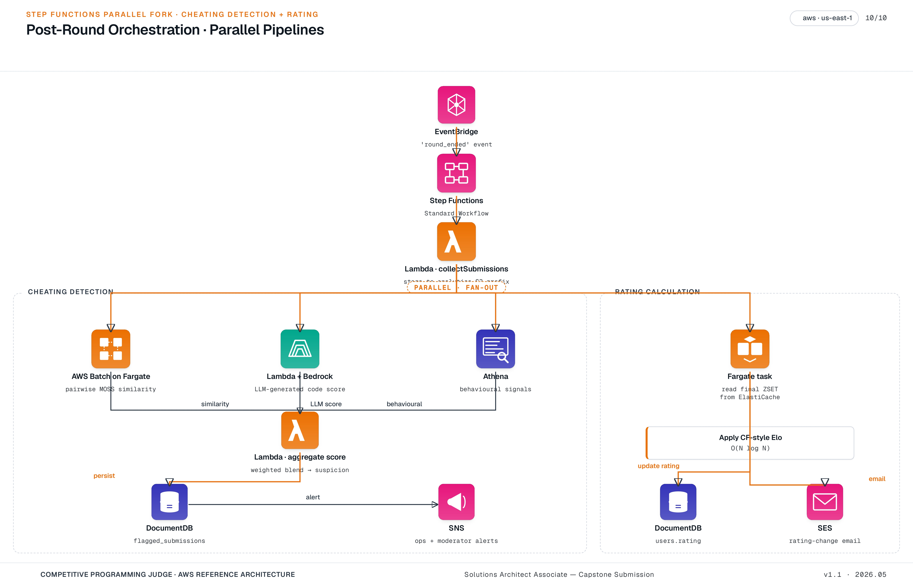

[← README](../README.md) | [← Prev: Architecture](./02-architecture.md) | **Post-Round Processing** | [Next: Design Decisions →](./04-design-decisions.md)

---

# 3. Post-Round Processing

A post-round pipeline runs **once per round** the moment the contest window closes. On a single Step Functions execution it does two things in parallel: it computes a **moderator review queue** for cheating detection, and it computes a **rating delta** for every ranked participant. Both branches are strict supersets of the judging path — the core platform stays fully functional with either branch disabled, and neither one touches the request path. The point of bundling them onto one workflow is operational, not functional: a single `round_ended` event drives both, a single Step Functions execution history covers both, and a single retry policy governs both.

## 3.1 Pipeline Architecture

The pipeline is shaped as one trigger, one fan-out, and two independent branches that converge only at the very end (a tiny notification state that emits a `round_processed` event). Drawing it this way makes the **independence** of the two branches the most visible property of the diagram — a stuck plagiarism job does not delay rating publication, and a rating-calc failure does not block moderator review.

**Trigger.** A single EventBridge `round_ended` event starts one Step Functions Standard execution per round. The round ID is the only input the workflow needs — everything else (submission manifest, language tags, S3 keys, the standings ZSET) is fetched from authoritative sources inside the first state.

**Two parallel branches.** Cheating detection (MOSS + Bedrock + Athena → aggregation) and rating calculation (read ZSET → apply Elo → write DocumentDB). They run on the same execution but neither blocks the other; Step Functions' `Parallel` state catches branch-level errors without aborting the sibling.

**Convergence.** Both branches converge into a final notification state that publishes a `round_processed` event to EventBridge with a status payload (`{cheating: ok, rating: ok}`, or `{cheating: failed, rating: ok}`, etc.). Downstream consumers — the moderator UI, the user-facing rating-change emails, the ops dashboard — all subscribe to this single event.

## 3.2 Trigger & Step Functions Topology

Round-end is an **application-level event**, not an infrastructure signal. When the web app marks a round as completed it puts a `round_ended` event on a custom EventBridge bus; an EventBridge rule matches the event and starts the Step Functions execution with the round ID as input. There is no cron, no scheduled scan of "rounds that ended in the last minute" — the workflow fires the instant the app declares the round closed.

**Standard, not Express.** Step Functions **Standard Workflows** are correct here for three reasons: executions last minutes-to-tens-of-minutes (Express is only viable below 5 minutes), the execution history must be queryable for auditability (Express writes to CloudWatch Logs only — no per-state visual trace), and the cost shape (per state transition) is fine at one execution per round.

**`collectSubmissions` first state.** A small Lambda runs as the first state. It reads the round's submissions and verdicts from DocumentDB, writes a Parquet manifest (problem ID, language, S3 key, user ID, verdict, submitted-at) to `s3://post-round/{round_id}/manifest.parquet`, and snapshots the final standings ZSET from ElastiCache to `s3://post-round/{round_id}/standings.json`. **The ZSET snapshot matters operationally** — it decouples the rating-calc branch from ElastiCache still holding the data and is the precondition for clean replay (see [§3.6](#36-idempotency-retries--replay)).

**Fan-out.** The next state is a Step Functions `Parallel` block with two branches. Both branches read from the manifest in S3, so neither depends on the other's progress, and the database is touched only at the end of each branch (one DocumentDB write per branch).

## 3.3 Cheating Detection Branch

This branch ingests one round's worth of submissions and produces a moderator review queue. The deep-dive diagram below shows every service the branch touches, including the IAM role boundaries and the S3 intermediate stores:

Three independent signals run in parallel inside this branch; a final aggregator combines them into per-submission suspicion scores.

**Plagiarism — pairwise code similarity (AWS Batch on Fargate).** For each `(problem, language)` pair in the round, compute a tokenized-AST similarity matrix across all submissions using the MOSS algorithm (or one of its open-source descendants). The work is N² per problem; for typical contest sizes (hundreds of submissions per problem, occasionally low thousands) **AWS Batch on a Fargate compute environment** is the right fit — Fargate keeps the operational surface zero, and the jobs are short enough that Fargate's per-second billing beats provisioning an EC2 fleet for one short burst per round. Output: similarity pairs above a tunable threshold, written to `s3://post-round/{round_id}/similarity.parquet`.

**LLM-generated code detection (Lambda + Bedrock).** For each submission, a Lambda invokes **Amazon Bedrock** with a carefully prompted Claude (or Llama) model and a JSON-schema-constrained output asking for an LLM-probability score and a short rationale. Bedrock is the right starting point because it removes model hosting entirely and lets us iterate on the prompt in days, not weeks. If per-round inference cost crosses a defined threshold at scale, the migration path is SageMaker batch transform with a fine-tuned classifier — see [Decision 4.5](./04-design-decisions.md).

**Behavioral signals (Athena).** An Athena query, fired from this branch (not a separate nightly Glue crawl), reads the submission and verdict partitions in S3 and produces per-submission flags: anomalously fast first-AC on a hard problem, sudden style change vs the user's submission history, identical edit-time patterns across multiple users, copy-paste-shaped timing on long submissions. These are cheap, deterministic SQL signals — never the only basis for action, but useful priors that get a moderator looking at the right submissions first.

**Aggregation (Lambda).** A final Lambda reads all three signal streams from S3, combines them into a per-submission suspicion score (weighted sum with the weights stored in **SSM Parameter Store** as configuration, not in code), and writes the flagged set to a `flagged_submissions` collection in DocumentDB with status `pending_review`. An SNS topic notifies the moderator team via email and Slack webhook. The Lambda is idempotent on `(round_id, submission_id)` so a retry is safe.

## 3.4 Rating Calculation Branch

**Why post-round only.** Codeforces-style ratings are an Elo variant: each participant's expected rank is computed against every other participant in the round, and the update is meaningful only against the **final** ranking. Applying it mid-contest produces deltas that flip every time another participant submits, which is both confusing to display and computationally wasteful. There is no v1 / v2 trade-off here — post-round is the only correct time to compute it.

**Compute (Fargate task).** A single ECS Fargate task is launched as a Step Functions task state. It reads the standings snapshot written by `collectSubmissions` (`s3://post-round/{round_id}/standings.json`), applies the **Codeforces-published simplified Elo formula** in O(N log N) for N=30K, and writes per-user rating deltas to a Parquet output. Reading from S3 — not directly from ElastiCache — means the branch survives an ElastiCache failover or eviction and is the precondition for replay. Cost: a single Fargate task running for <1 minute per round, with no idle baseline.

**Write (idempotent batch into DocumentDB).** Rating deltas are written as a batch update on `users.rating` and an append to `users.rating_history`. Idempotency is keyed on `(user_id, round_id)` — if Step Functions retries the state on a transient failure, the second write overwrites cleanly rather than double-applying the delta. Both writes use a `bulkWrite` with `ordered: false` so a single bad user's record cannot stall the whole batch.

**Notify.** Successful completion publishes a `rating_calculated` event to EventBridge. Two downstream rules consume it: (a) the orchestrator (judge1) pushes a "new rating" frame over the user's already-open **API Gateway WebSocket** connection so the rating change surfaces in the SPA the moment the user opens the standings page, and (b) **Amazon SES** sends an opt-in "your rating changed" email to users who enabled the preference.

## 3.5 Moderator Review Workflow

Flagged submissions land in DocumentDB but a moderator does not pick them up from there directly — the web app provides a moderator-only triage view backed by an authenticated `/api/moderation/queue` endpoint on the orchestrator (judge1). The endpoint requires the `role: moderator` claim on the Cognito JWT (see [§2.1.2](./02-architecture.md#212-identity--user-lifecycle)) and **MFA** is required to obtain that token in the first place.

**Triage actions.** A moderator can `confirm`, `dismiss`, or `escalate` a flag. Each action writes to `moderation_actions` in DocumentDB with the moderator ID, timestamp, and free-text justification, and updates the flagged submission's status. Confirms can attach a penalty (rating freeze, round disqualification, account suspension).

**Feedback loop for ML.** The `(submission, signals, moderator_decision)` triples are the **ground-truth labels** for a future fine-tuned classifier. They are emitted to S3 as Parquet on every action, partitioned by month, and queryable from Athena. When the dataset crosses a usable size, this is what trains the SageMaker model that replaces the Bedrock-prompted detector in [Decision 4.5](./04-design-decisions.md).

## 3.6 Idempotency, Retries & Replay

The pipeline runs once per round, but "once" is a target not a guarantee — transient AWS errors, throttles, and human re-triggers all happen. The design is built so that **re-issuing the `round_ended` event for the same round is safe**, by construction.

**Step Functions retries.** Every task state has an explicit `Retry` block on `States.TaskFailed` and `States.Timeout` (3 attempts, exponential backoff, max 30s). Failures past the retry budget hit a `Catch` that routes execution to a tail-call state which logs the error to a `pipeline_failures` DocumentDB collection and publishes a `round_processing_failed` event — without aborting the sibling branch.

**Idempotency keys.** All terminal writes are keyed: `flagged_submissions` on `(round_id, submission_id)`, `users.rating` on `(user_id, round_id)`. The `collectSubmissions` S3 manifest write is content-addressed by round ID, so re-running overwrites the same key.

**Replay.** Re-issuing the `round_ended` event triggers a brand-new Step Functions execution. Because every state reads from S3 (the manifest and ZSET snapshot are stable), a replay produces the same result. ElastiCache may have already evicted the round's ZSET by the time of replay — that's fine; the snapshot is in S3.

**DLQ for the trigger.** The EventBridge rule has a **dead-letter SQS queue** configured for the case where Step Functions itself fails to accept the start request (a rare but real failure mode under throttling). An operator can re-drive the DLQ to retrigger the workflow without needing application-side intervention.

---

[← README](../README.md) | [← Prev: Architecture](./02-architecture.md) | **Post-Round Processing** | [Next: Design Decisions →](./04-design-decisions.md)
