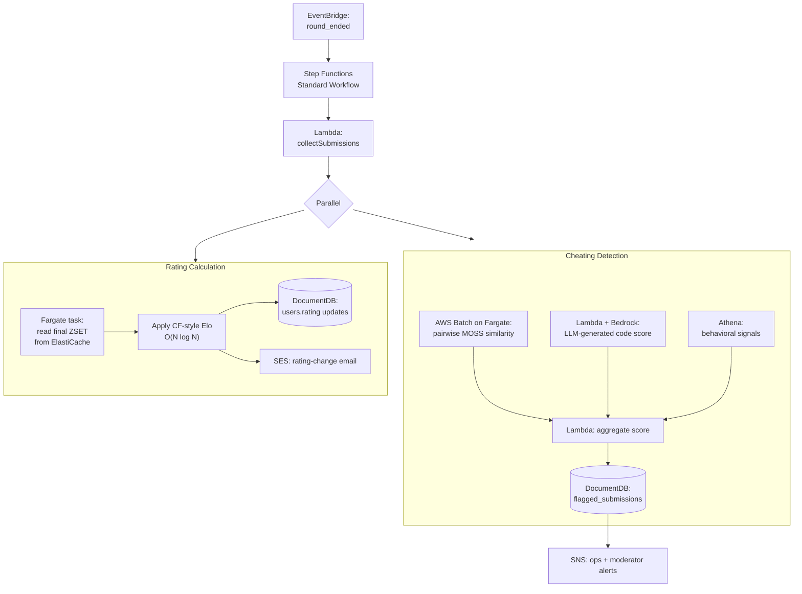
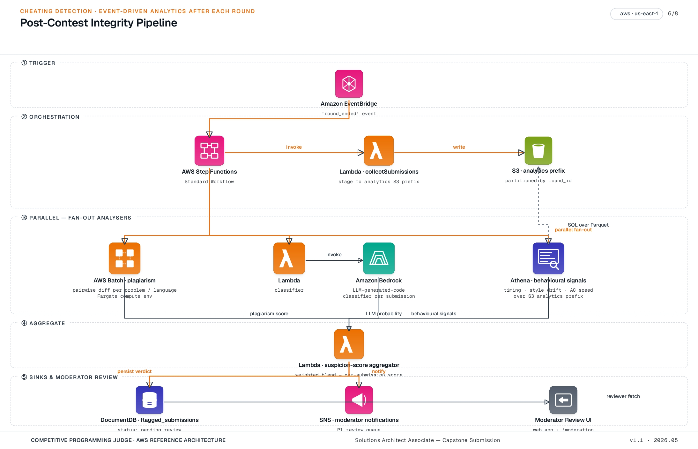

[← README](../README.md) | [← Prev: Architecture](./02-architecture.md) | **Post-Round Processing** | [Next: Design Decisions →](./04-design-decisions.md)

---

# 3. Post-Round Processing

A post-round pipeline runs **once per round** after the contest window closes. It does two things on the same Step Functions execution: it computes a moderator review queue for **cheating detection**, and it computes a **rating delta** for every ranked participant. Both are strict supersets of the judging path — the core platform is fully functional without either, and either branch can be disabled without touching the request path.

## 3.1 Pipeline Architecture

Detailed diagram with services and IAM roles: 

## 3.2 Trigger and Orchestration

Round-end is an application-level event. When the web app marks a round as completed, it puts a `round_ended` event on a custom EventBridge bus. An EventBridge rule matches this event and starts a **Step Functions Standard Workflow** execution with the round ID as input. Step Functions **Standard** (not Express) is correct here — these executions take minutes to tens of minutes and we want the full execution history for auditability.

The first state is a `collectSubmissions` Lambda that produces the round's submission manifest (problem IDs, language tags, S3 keys) and writes it to S3. From there the workflow fans out into two parallel branches: cheating detection and rating calculation. The branches do not depend on each other — a delay in MOSS does not delay ratings being published, and a rating-calc failure does not block moderator review.

## 3.3 Cheating Detection Branch

**Plagiarism — pairwise code similarity.** For each (problem, language) pair in the round, compute a similarity matrix across all submissions using a tokenized-AST approach (the MOSS algorithm and its open-source descendants are well-suited). This is N² per problem, which for typical contest sizes (hundreds of submissions per problem, occasionally low thousands) is comfortably handled by **AWS Batch on a Fargate compute environment** — Fargate keeps the operational surface zero, and the batch is short enough that Fargate's per-second billing is competitive with EC2. Output: pairs of submissions with similarity above a tunable threshold, written to S3 as Parquet.

**LLM-generated code detection.** For each submission, a Lambda invokes Amazon Bedrock with a carefully prompted Claude (or Llama) model and a structured-output schema asking for an LLM-probability score and a short rationale. Bedrock is the right starting point because it removes the need to host a model and lets us iterate on the prompt in days, not weeks. If per-round inference cost becomes a concern at scale, the path is to a SageMaker-hosted classifier — covered in [Design Decisions](./04-design-decisions.md).

**Behavioral signals.** An Athena query (event-driven from the Step Functions branch, not a separate nightly Glue crawl) reads the submission and verdict partitions in S3 and produces per-submission flags: anomalously fast first-AC on a hard problem, sudden style change vs the user's submission history, identical edit-time patterns across multiple users, and so on. These are cheap, deterministic SQL signals — they should never be the only basis for action, but they're useful priors.

**Aggregation and review.** A final Lambda reads all three signal streams from S3, combines them into a per-submission suspicion score (weighted sum with weights as configuration, not code), and writes flagged submissions to a `flagged_submissions` collection in DocumentDB with status `pending_review`. An SNS topic notifies the moderator team via email and (optionally) a Slack webhook. Moderators triage flagged submissions in the web app; their confirm/dismiss/escalate actions are persisted as ground-truth labels that feed a future fine-tuned classifier.

## 3.4 Rating Calculation Branch

**Why post-round, not live.** Codeforces-style ratings are an Elo variant where each participant's expected rank is computed against every other participant. The update is meaningful only when the final ranking is known — applying it mid-contest produces values that change every time someone else submits, which is both confusing to display and computationally wasteful. Post-round is the only correct time to compute it.

**Compute.** A Fargate task reads the final state of the contest's standings ZSET from ElastiCache (the same sorted set the Standings Publisher has been maintaining during the round — see [§2.1.7](./02-architecture.md#217-live-standings--rating)). With N=30K participants, the naïve O(N²) pairwise expected-rank formula is wasteful; the CF-published simplified formula is O(N log N) and runs in well under a minute on a single Fargate task. The output is a per-user rating delta.

**Write.** Rating deltas are written into DocumentDB as an idempotent batch update on `users.rating` and an append to `users.rating_history`. Idempotency matters because Step Functions can retry the state on transient failure; the write is keyed on `(user_id, contest_id)` so a retry overwrites cleanly rather than double-applying.

**Notify.** Successful completion of the branch publishes a `rating_calculated` event back to EventBridge. A downstream rule fans this out to (a) the web app via the WebSocket connection so the user sees their new rating on the standings page, and (b) **Amazon SES** for an opt-in "your rating changed" email.

**Failure mode.** If the rating-calc Fargate task fails irrecoverably, Step Functions catches the error and publishes a `rating_calculation_failed` event with the round ID. The branch is **independent of the cheating-detection branch** — a rating-calc failure does not block moderator review of flagged submissions, and vice versa. The round's standings (the ZSET) are persisted to S3 as a backup snapshot during the `collectSubmissions` step, so a failed rating run can be re-driven by re-issuing the `round_ended` event without depending on ElastiCache still holding the data.

---

[← README](../README.md) | [← Prev: Architecture](./02-architecture.md) | **Post-Round Processing** | [Next: Design Decisions →](./04-design-decisions.md)
