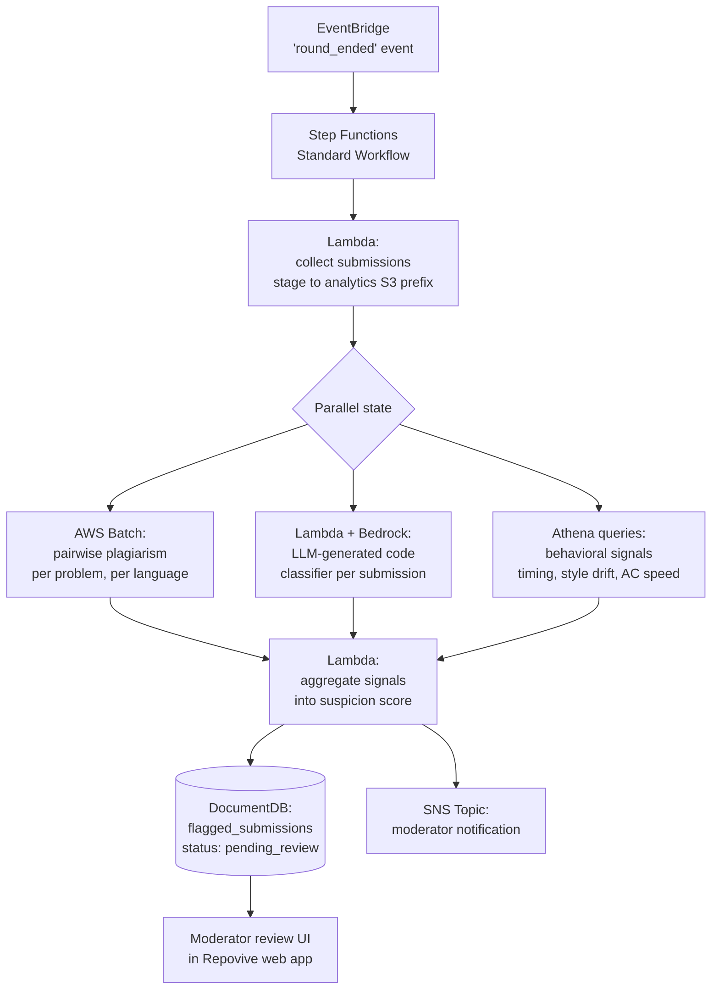

[← README](../README.md) | [← Prev: Architecture](./03-architecture.md) | **Cheating Detection** | [Next: Design Decisions →](./05-design-decisions.md)

---

# 4. Post-Round Analytics: Cheating Detection Pipeline

This is Phase 6 of the migration — it lights up after the core platform is on AWS and S3 contains submission code. The pipeline runs **once per round** on the round's completed submissions and produces a moderator review queue.

## 4.1 Pipeline Architecture

## 4.2 Trigger and Orchestration

Round-end is an application-level event. When the web app marks a round as completed, it puts a `round_ended` event on a custom EventBridge bus. An EventBridge rule matches this event and starts a Step Functions Standard Workflow execution with the round ID as input. Step Functions Standard (not Express) is correct here — these executions take minutes to tens of minutes and we want the full execution history for auditability.

## 4.3 Signals

**Plagiarism — pairwise code similarity.** For each (problem, language) pair in the round, compute a similarity matrix across all submissions using a tokenized-AST approach (the MOSS algorithm and its open-source descendants are well-suited). This is N² per problem, which for typical contest sizes (hundreds of submissions per problem, occasionally low thousands) is comfortably handled by a single AWS Batch job using an EC2 compute environment. Output: pairs of submissions with similarity above a tunable threshold, written to S3 as Parquet.

**LLM-generated code detection.** For each submission, a Lambda invokes Amazon Bedrock with a carefully prompted Claude (or Llama) model and a structured-output schema asking for an LLM-probability score and a short rationale. Bedrock is the right starting point because it removes the need to host a model and lets us iterate on the prompt in days, not weeks. If per-round inference cost becomes a concern at scale, the migration path is to a SageMaker-hosted classifier — covered in [Design Decisions](./05-design-decisions.md).

**Behavioral signals.** A nightly Glue job partitions the submissions and verdicts in S3 by date, problem, and user. Athena queries then produce per-submission flags: anomalously fast first-AC on a hard problem, sudden style change vs the user's submission history, identical edit-time patterns across multiple users, and so on. These are cheap, deterministic SQL signals — they should never be the only basis for action, but they're useful priors.

## 4.4 Aggregation and Review

A final Lambda reads all three signal streams from S3, combines them into a per-submission suspicion score (weighted sum with weights as configuration, not code), and writes flagged submissions to a `flagged_submissions` collection in DocumentDB with status `pending_review`. An SNS topic notifies the moderator team via email and (optionally) a Slack webhook.

Moderators triage flagged submissions in the Repovive web app; their confirm/dismiss/escalate actions are persisted as ground-truth labels that feed a future fine-tuned classifier.

---

[← README](../README.md) | [← Prev: Architecture](./03-architecture.md) | **Cheating Detection** | [Next: Design Decisions →](./05-design-decisions.md)
