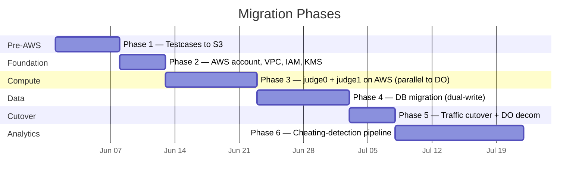

[← README](../README.md) | [← Prev: Design Decisions](./05-design-decisions.md) | **Migration Plan** | [Next: Well-Architected →](./07-well-architected.md)

---

# 6. Migration Plan

Each phase is independently rollback-able. The plan is structured so that the highest-value, lowest-risk work happens first.

**Phase 1 — Test cases out of MongoDB into S3.** This phase is done **while still on DigitalOcean**. We provision a single AWS account, create the `repovive-testcases` S3 bucket, write a one-time migration script to dump test cases from MongoDB and upload them to S3 with the agreed key structure, and modify `judge1`'s test-case loader to fetch from S3 by `problem_id`. Feature-flag the change so we can flip back to Mongo instantly. Success criterion: judge1 reads 100% of test cases from S3 for 7 consecutive days with no MongoDB fallback. Rollback: flip the feature flag.

**Phase 2 — AWS foundation.** Provision the VPC (three subnet tiers across two AZs), Transit Gateway is not needed (single VPC), NAT Gateway, IAM roles for ECS tasks and Lambda, KMS CMKs, Secrets Manager entries (initially placeholder), CloudWatch log groups, S3 buckets for `submissions` and `analytics`. All via CloudFormation (or Terraform — choose one and stick with it). Success criterion: `cfn-lint`-clean templates applied to a fresh account. Rollback: stack delete.

**Phase 3 — `judge0` and `judge1` on AWS, running in parallel.** Stand up the ECS-on-EC2 `judge0` cluster, the Fargate `judge1` service, ElastiCache Redis, RDS Postgres. The web app continues to send all real traffic to DigitalOcean. We shadow a percentage of submissions to the AWS stack and compare verdicts to catch any subtle differences (`isolate` version skew, compiler version skew, etc.). Success criterion: 10,000 shadowed submissions with 100% verdict parity. Rollback: stop the shadow traffic — the production path is untouched.

**Phase 4 — Database migration (DocumentDB) with dual-write.** Modify `judge1` and the web app to dual-write all new submissions and verdicts to both MongoDB (DO) and DocumentDB (AWS). Run a one-time backfill of historical app data using `mongodump`/`mongorestore`. Run an end-to-end consistency check across both databases for 7 days. Success criterion: zero divergence between the two stores for 7 consecutive days. Rollback: disable the DocumentDB write path; DO MongoDB remains canonical.

**Phase 5 — Traffic cutover and DO decommissioning.** Update DNS to point to the AWS public ALB. Keep DocumentDB and MongoDB in sync for one additional week as a safety net, then cut writes to MongoDB. Once the week is clean, decommission DigitalOcean droplets and the legacy MongoDB instance. Success criterion: AWS handles 100% of traffic for 7 days with SLOs met. Rollback: DNS flip back.

**Phase 6 — Cheating-detection pipeline.** Build out the Step Functions workflow, Bedrock-based LLM detector, AWS Batch plagiarism job, Glue/Athena behavioral pipeline, and moderator review UI in the web app. Run shadow on the last three completed rounds with no notifications enabled, calibrate the suspicion-score weights against moderator-labeled ground truth, then enable notifications. Success criterion: precision of flagged-and-confirmed-cheating > 80% on a held-out test round.

---

[← README](../README.md) | [← Prev: Design Decisions](./05-design-decisions.md) | **Migration Plan** | [Next: Well-Architected →](./07-well-architected.md)
